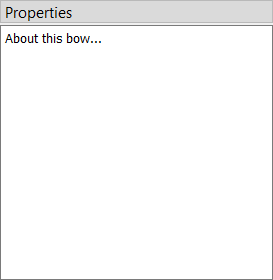

#  Comments

The Comments item at the top of the model tree is provided purely for documentation.
It does not affect the simulation in any way.
You can use this section to record notes about anything, including the bow design, its parameters, design decisions, or observations from simulations.

<figure>
  
  <figcaption><b>Figure:</b> Comment box</figcaption>
</figure>
