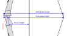
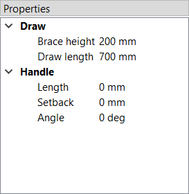
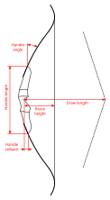

#  Draw

Here, the brace height and draw length under which the bow operates are defined.
Both values reference the bow's pivot point, which is configured in the [Handle](model-editor-handle.md) section, so they only become meaningful once the handle has been properly set up.
See also the figure below for a visual definition of each parameter.

**Brace height:** The brace height is measured as the distance between the bowstring and the handle's pivot point on the braced bow.
VirtualBow automatically determines the string length required to achieve the specified brace height.

**Draw length:** The bow's draw length can be specified according to two conventions.
Choosing between them is purely a matter of preference and convenience and has no other effects.

- **Standard:** Under the *Standard* convention, the draw length is defined as the distance between the handle's pivot point and the string at full draw - sometimes referred to as the *true* draw length.

- **AMO:** The alternative is the *AMO* convention, defined by the *Archery Manufacturers Organization*, where the draw length is taken as the pivot-to-string distance plus 1.75 inches.
This definition is widely used by bow manufacturers.

 
<figure>
  
  <figcaption><b>Figure:</b> Definition of the brace height and draw length in both conventions.</figcaption>
</figure>

<!--

# Dimensions

The dimensions define some overall lengths and angles of the bow, including an optional stiff middle section.

<figure>
  
  <figcaption><b>Figure:</b> Dimensions</figcaption>
</figure>

**Draw**

- **Brace height:** Distance between the deepest point of the handle and the string at rest

- **Draw length:** Distance between the deepest point of the handle and the string at full draw

**Handle**

- **Length:** Optional length of a stiff middle section (grip/riser) between the limbs

- **Setback:** Distance between the deepest point of the grip and the attachment point of the limbs to the middle section

- **Angle:** Angle at which the limbs are attached to the middle section

See the image below for a visual definition of the dimensions.

<figure>
  
  <figcaption><b>Figure:</b> Definition of the dimensions</figcaption>
</figure>

-->
