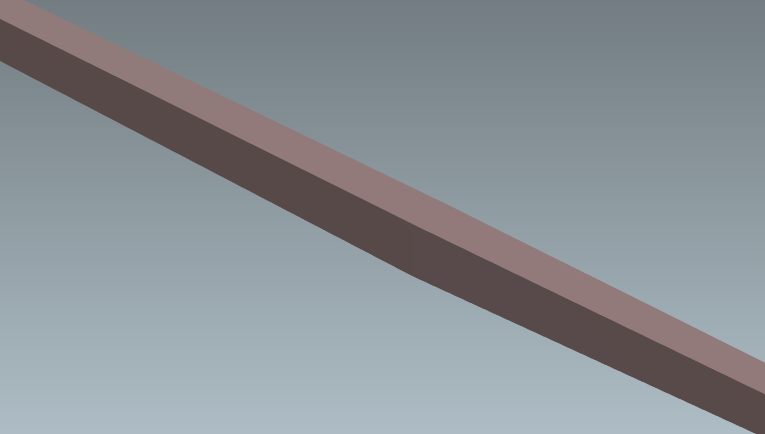
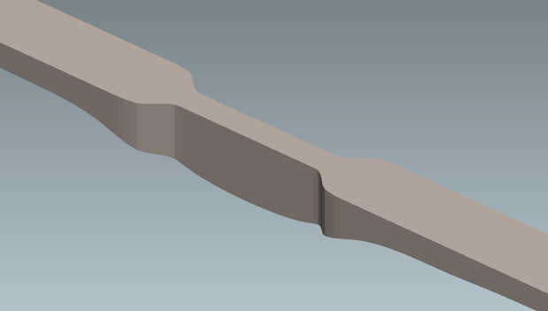
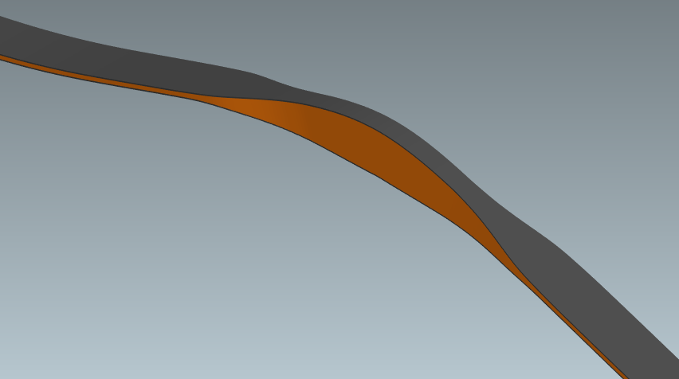
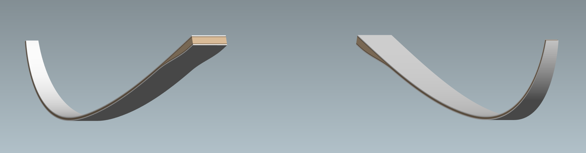
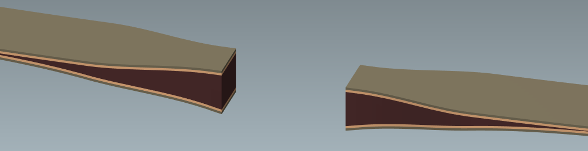
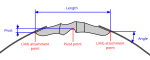

#  Handle

This category determines how the middle section of the bow is modeled.
There are two options to choose from: *Flexible* and *Rigid*.
Selecting *Flexible* means the middle section is fully modeled and simulated as part of the limb geometry you define later.
If your bow has a middle section that shouldn't or can't be modeled in VirtualBow, choose *Rigid* to specify the dimensions of a rigid section placed between the limbs.

## Flexible

A flexible handle is the simplest option - no additional parameters are required.
You model the handle as part of the limb geometry, and the simulation treats it just like the rest of the limb.
Of course, the options for modeling intricate handle geometries in VirtualBow are limited, since this is not its primary focus.

<figure>
  
  
  
  <figcaption><b>Figure:</b> Some examples for bows with a handle modeled as <i>Flexible</i>. It doesn't matter whether the handle actually flexes significantly or not.</figcaption>
</figure>

The bow’s pivot point, which is later needed for defining brace height and draw length, is automatically placed on the belly side of the bow’s center.

## Rigid

Selecting *Rigid* allows you to specify a rigid middle section of the bow to which the limbs are attached.
This configuration is typical for takedown bows with a riser, but it can also be used for other middle‑section designs that you prefer not to model explicitly in VirtualBow.

<figure>
  
  
  <figcaption><b>Figure:</b> Some examples of bows with a handle modeled as <i>Rigid</i>.</figcaption>
</figure>

The following parameters are required for a rigid handle.
They determine the spacing and orientation of the two limbs as well as the placement of the pivot point.
See also the figure below for a visual definition of each parameter.

**Length:** Specifies the length of the rigid middle section, measured as the distance between the limb attachment points.
The limbs are attached to the attachment points by their belly-side edges.

**Angle:** Sets the angle at which the limbs attach to the rigid middle section.
Positive angles add reflex; negative angles add deflex.

**Pivot:** Defines the position of the pivot point relative to the limb attachment points.
Positive values add reflex; negative values add deflex.
The pivot point is used as the reference for measuring brace height and draw length.

<figure>
  
  <figcaption><b>Figure:</b> Definition of the rigid handle dimensions, shown here on a typical modern recurve‑bow riser. Note that the actual flexible limbs start at the attachment points, the portion fixed to the riser belongs to the middle section.</figcaption>
</figure>

 

> [!NOTE]
> When choosing the cutoff point between the limb and the rigid handle, make sure the actual limb geometry includes any fadeouts where the handle transitions into the limb.

> [!NOTE]
> You may still choose *Rigid* for the additional settings even when the handle itself is modeled as part of the limb geometry.
> This is useful, for example, if you want to override the pivot point placement: simply define a zero‑length rigid handle and set the pivot point as needed.
