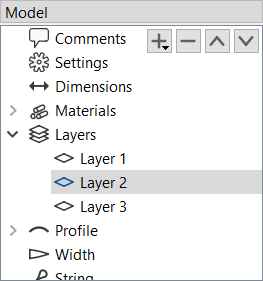
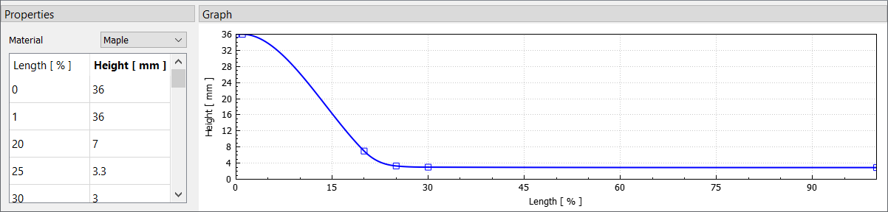

# Layers

Layers define the makeup of the bow in the thickness/height direction.
A bow can have multiple layers of different materials or only a single layer (self bows).

<figure>
  
  <figcaption><b>Figure:</b> Layers in the model tree</figcaption>
</figure>

If the _Layers_ category in the model tree is selected, the buttons (, , , ) can be used to add, remove and reorder layers.
Layers can be renamed by double-clicking and entering a new name.

<figure>
  
  <figcaption><b>Figure:</b> Layer properties</figcaption>
</figure>

Each layer consists of a material and a height/thickness distribution.
The material can be selected from the drop-down list, which shows all materials that were previously added under [Materials](model-editor-materials.md).

The height distribution is defined by a table of relative length and height values.
Each table row must contain a relative length along the limb (from 0% to 100%) and the corresponding layer height.
Layer heights may be zero over portions of the length.
This is useful for modelling layers that don't cover the whole limb.
Common examples for this are fadeouts and tip wedges.

The actual height distribution is constructed as a smooth curve (monotone cubic spline) passing through the supplied values and is shown in the _Graph_ panel.
You can use the context menu for additional options on the plot, like showing/hiding control points or adding an overlay image.