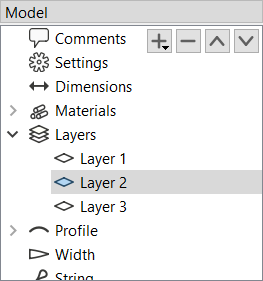
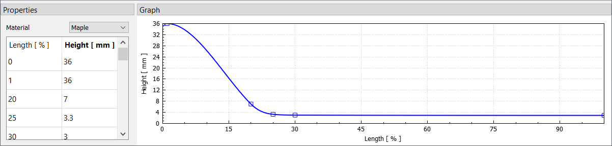
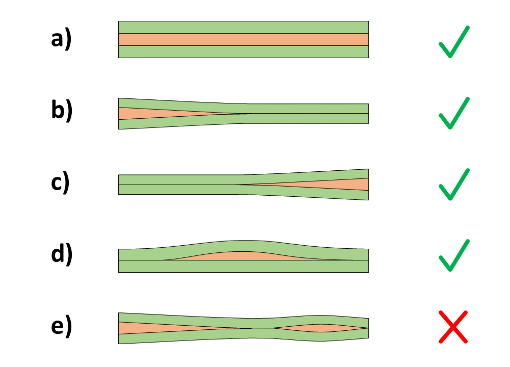
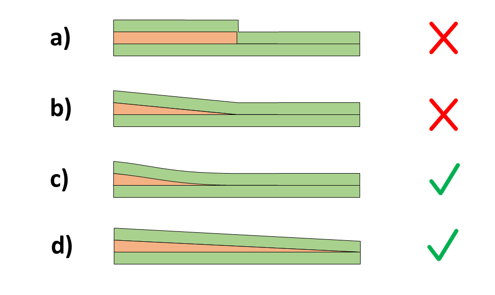

#  Layers

Layers define the makeup of the bow in the thickness direction.
A bow may consist of a single continuous layer, as in traditional self bows, or it may be built from multiple layers made from different materials.

<figure>
  
  <figcaption><b>Figure:</b> Layers in the model tree</figcaption>
</figure>

If the _Layers_ category in the model tree is selected, the buttons (, , , ) can be used to add, remove and reorder layers.
The order of layers in the list corresponds to their actual stacking order in the limb.
Layers can be renamed by double-clicking and entering a new name.

## Layer properties

<figure>
  
  <figcaption><b>Figure:</b> Layer properties</figcaption>
</figure>

**Material:** Each layer references a material and has a defined thickness distribution over its length.
The material can be selected from the drop-down list, which contains all materials previously added under [Materials](model-editor-materials.md).
Multiple layers may reference the same material.

**Thickness:** The thickness distribution is specified by a table of relative length and thickness values.
Each row must contain a relative length along the limb (from 0% to 100%) and the corresponding layer thickness.
Layers don't have to span the full limb length; they may start or end within the limb to model features such as fadeouts or tip wedges.
Some [additional rules](#additional-rules) described below ensure that all layers together form a valid geometry.
The actual thickness profile is constructed as a smooth curve (a monotone cubic spline) passing through the provided values and is displayed in the _Graph_ panel.
The plot's context menu offers additional options, such as showing or hiding control points or adding an overlay image.

## Additional rules

A few rules must be observed when defining layer thickness to ensure that the limb geometry ends up being well‑defined.
VirtualBow handles these checks for you - either enforcing the rules automatically or showing an error message when something isn't allowed - so you don’t have to keep them all in mind yourself.

### Disjoint layers

Layers may have a thickness of zero at their start or end to model layers that fade out <b>(b)</b>, fade in <b>(c)</b> or both <b>(d)</b>.
However, they may not contain a zero-thickness point somewhere inbetween, as this would create multiple disjoint layer segments <b>(e)</b>.

Also, even though individual layers do not need to span the entire limb, the <i>combined</i> thickness of all layers must be positive along the full limb length.
In other words, the stack of layers must cover the entire limb without gaps.

### Continuity

Layers that start or end within the limb must taper to zero thickness to avoid creating a visible discontinuity in the geometry <b>(a)</b>.
However, this alone could still create a kink in adjacent layers, as shown in case <b>(b)</b>.
To prevent this, a layer that fades in or out within the limb must have both zero thickness <i>and</i> zero slope at that point <b>(c)</b>.
This requirement does not apply to layer endpoints that coincide with the limb's endpoints <b>(d)</b>.

