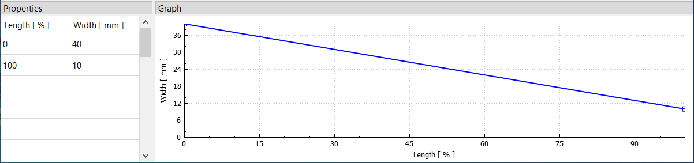

#  Width

The width distribution along the limb defines its side‑to‑side shape, which is shared by all layers.
It is defined by a table of relative length and width values.
Each row specifies a position along the limb (from 0% to 100%) and the corresponding width of the limb at that point.
A smooth curve (a monotone cubic spline) is fitted through these values to create the final width distribution, which is displayed in the *Graph* panel.
The plot's context menu offers additional options, such as showing or hiding control points or adding an overlay image.

<figure>
  
  <figcaption><b>Figure:</b> Width properties</figcaption>
</figure>
