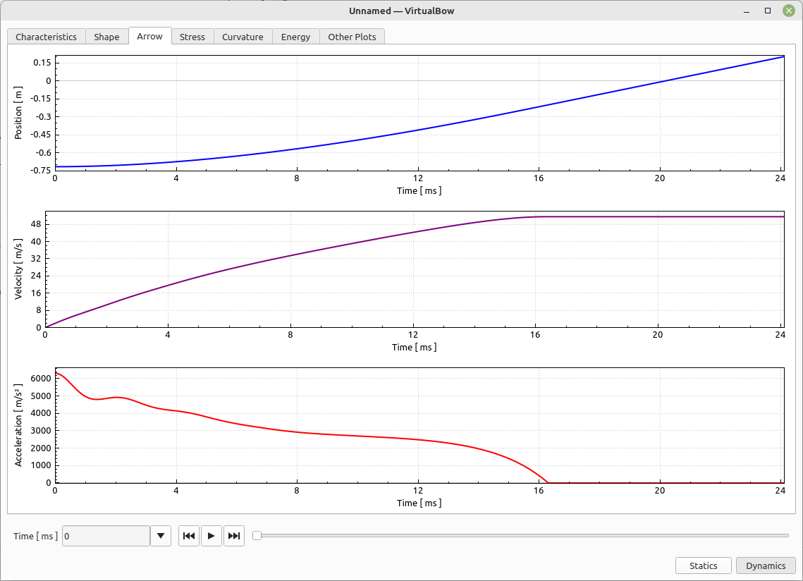

# Arrow

This tab is available only for dynamic simulations.
It visualizes the motion of the arrow throughout the shot by plotting its position, velocity and acceleration over time.
Together, these three curves show how the bow transfers energy into the arrow and how the arrow's motion develops from release to separation.

<figure>
  
</figure>

**Position:** Shows how far the arrow has traveled from its starting point at each moment.

**Velocity:** Shows how quickly the arrow is moving at each moment.
The arrow's velocity typically rises until the arrow leaves the string, then remains constant.

**Acceleration:** Shows how strongly the bow is accelerating the arrow at each moment.
Typically decreases to zero at the time the arrow separates from the string.
A slight negative acceleration (deceleration) right before separation can occur due to the **arrow clamp force** defined in the [Settings](model-editor-settings.md#dynamics).
