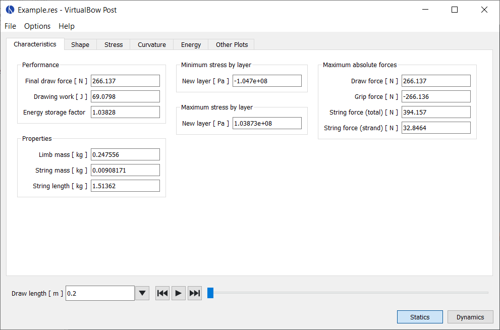

# Characteristics

Shows all results that can be expressed as a single value.
Some of them are specific to static or dynamic analysis, others are common in both.

<figure>
  
  <figcaption><b>Figure:</b> Screenshot of the static characteristics tab</figcaption>
</figure>

**Statics**

- **Final draw force:** The draw force of the bow at full draw

- **Drawing work:** Total work done by drawing the bow. This work is stored in the bow as potential elastic energy and later partially transfered to the arrow, depending on the bow's efficiency. It is equal to the area under the force-draw curve of the bow.

- **Energy storage factor:** This value indicates how good the shape of the draw curve is in terms of energy storage. It is defined as the energy stored by the bow in relation to the energy that would have been stored with a linear draw curve. The energy storage factor increases the "more convex" the shape of the draw curve is.

- **Factor < 1:** The draw curve stores less energy than a linear draw curve

- **Factor = 1:** The draw curve stores as much energy as a linear draw curve

- **Factor > 1:** The draw curve stores more energy than a linear draw curve

- **Limb mass:** Total mass of a single bow limb, including the additional tip mass

- **String mass:** Total mass of the bow string, including additional masses

- **String length:** Length of the string, determined by the desired brace height

**Dynamics**

- **Final arrow velocity:** Velocity of the arrow when departing from the bow

- **Degree of efficiency:** The bow's degree of efficiency, i.e. how much of the energy input (drawing work) is converted into useful output (kinetic energy of the arrow)

- **Kinetic energy arrow:** Kinetic energy of the arrow on departure from the string

- **Kinetic energy limbs:** Kinetic energy of the limbs on arrow departure

- **Kinetic energy string:** Kinetic energy of the string on arrow departure

**Common**

- **Minimum and maximum stresses:** Maximum stress by absolute value for each layer. Positive values indicate tension, negative values compression.

- **Maximum absolute forces:** Maximum forces by absolute value. Entries are the draw force, the string force and the grip support force, i.e. the force that would be required to hold the bow handle.
