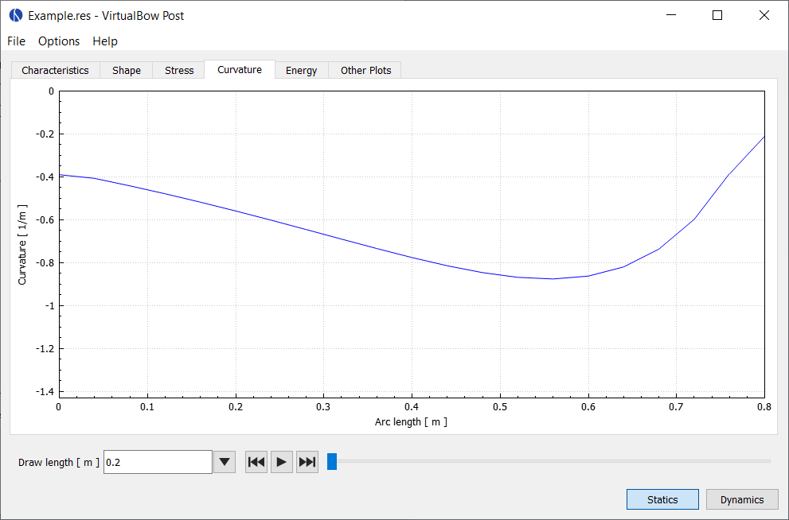

# Curvature

Shows the curvature of the limb along its length.
This is not the total curvature but rather the difference to the unbraced shape.

<figure>
  
  <figcaption><b>Figure:</b> Screenshot of the curvature tab</figcaption>
</figure>