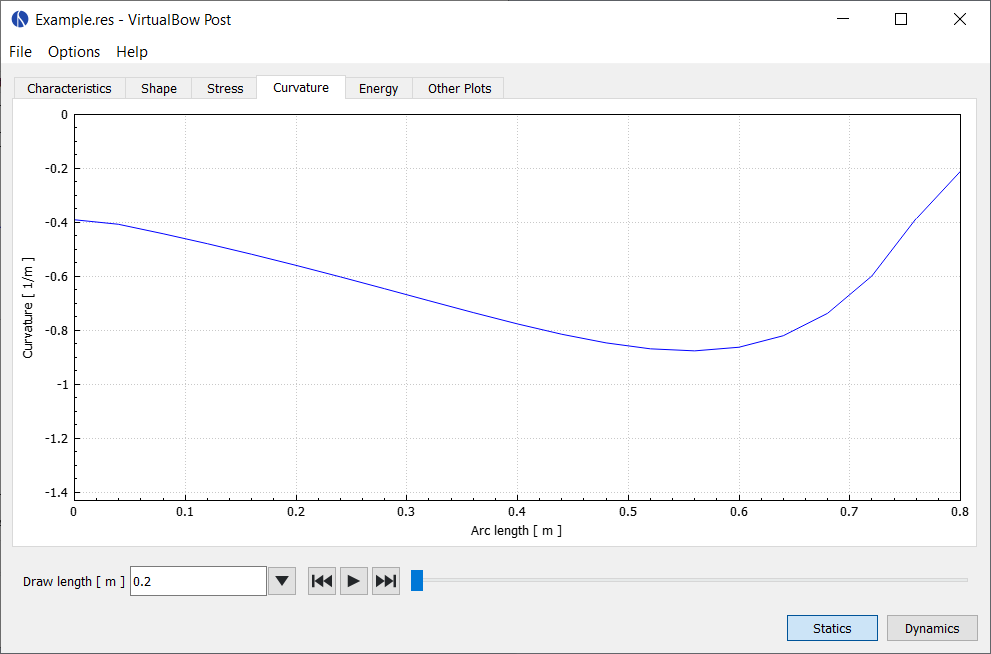

# Curvature

This tab shows the limb’s curvature along its length, measured relative to its initial unbraced shape.
It offers an additional way to assess the bow's tiller by highlighting which sections of the limb are bending more and which are bending less.

<figure>
  
</figure>
