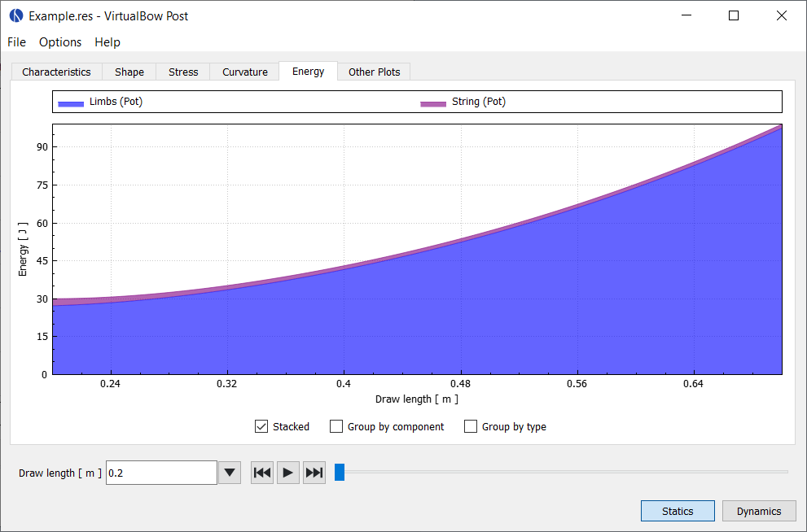
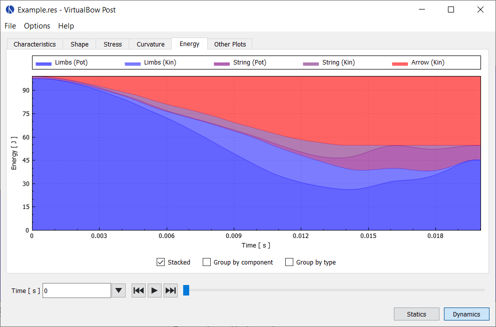

# Energy

This plot shows how the energy stored in the bow evolves during the simulation and how it is distributed between components (limbs, string, arrow) and energy types (elastic/potential, kinetic, damping losses).
For **static** simulations, it displays how the elastic energy in the limbs and string builds up during the draw.
No kinetic energies or damping losses are shown, because they are zero in a static analysis.
For **dynamic** simulations, it shows how the initial elastic energy in the limbs is transferred to the arrow and other bow components, as well as how much unused energy remains in the bow after the arrow departs.

<figure>
  
  <figcaption><b>Figure:</b> Screenshot of the energy tab for static results</figcaption>
</figure>

<figure>
  
  <figcaption><b>Figure:</b> Screenshot of the energy tab for dynamic results</figcaption>
</figure>

In both modes, three display options can be selected independently:

- **Stacked:** Stacks all energy curves to show how they add up. If the simulation was correct, their sum should be constant.

- **Group by component:** Group energies by component (limbs, string, arrow, damping)

- **Group by type:** Group the energies only by type (elastic, kinetic, damping)

The reference for all elastic energies shown is the initial, unbraced state of the bow.
This means the energy required to brace the bow is included.
