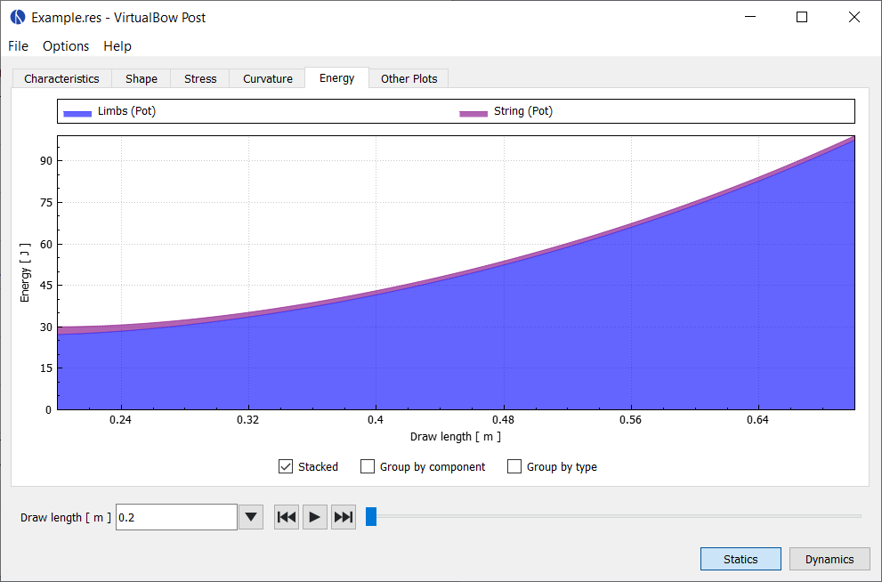
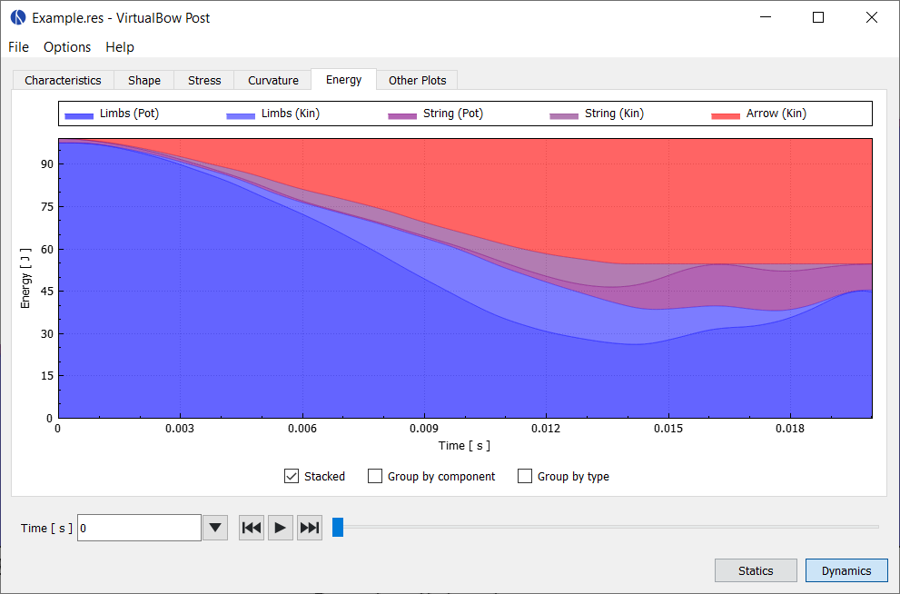

# Energy

This plot shows how the energy stored in the bow develops during the simulation and how it is distributed between components (limbs, string arrow) and type of energy (potential/elastic or kinetic).

In the static case it shows how the elastic energy of the limbs and string develops during draw.
No kinetic energies are shown, because they are zero in static analysis.

<figure>
  
  <figcaption><b>Figure:</b> Screenshot of the energy tab for static results</figcaption>
</figure>

In the dynamic case it shows how the initial potential energy of the limbs is transferred to the arrow and other components of the bow and how much unused energy stays in the bow after the departure of the arrow.

<figure>
  
  <figcaption><b>Figure:</b> Screenshot of the energy tab for dynamic results</figcaption>
</figure>

In both cases there are three options for display that can be selected individually:

- **Stacked:** Stack the energies on top of each other, so it can bee seen how they add up

- **Group by component:** Group the energies only by component (limbs, string, arrow)

- **Group by type:** Group the energies only by type (potential, kinetic)