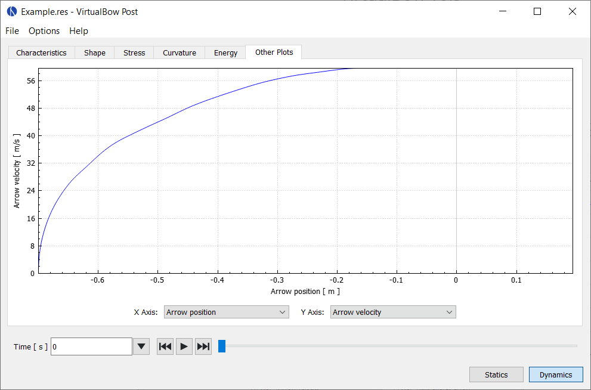

# Other Plots

Here you can combine arbitrary simulation results and plot them together in order to visualize things that aren't shown on any of the default plots.
Examples are the draw curve of the bow (draw force over draw length) or the velocity of the arrow over time.

<figure>
  
  <figcaption><b>Figure:</b> Screenshot of the other plots tab</figcaption>
</figure>

Data series available in static analysis:

| Data Series               | Description                             |
|:--------------------------|:----------------------------------------|
| Draw length               | Length to which the bow is drawn        |
| Draw force                | Draw force of the bow                   |
| String force (total)      | Tension force in the string             |
| String force (strand)     | String tension per strand               |
| Grip force                | Force that is required to hold the grip |
| Pot. energy limbs         | Potential energy of the limbs           |
| Pot. energy string        | Potential energy of the string          |

Data series available in dynamic analysis:

| Data Series               | Description                             |
|:--------------------------|:----------------------------------------|
| Time                      | Time since the release of the shot      |
| Arrow position            | Position of the arrow                   |
| Arrow velocity            | Velocity of the arrow                   |
| Arrow acceleration        | Acceleration of the arrow               |
| String force (total)      | Tension force in the string             |
| String force (strand)     | String tension per strand               |
| Grip force                | Force that is required to hold the grip |
| Pot. energy limbs         | Potential energy of the limbs           |
| Kin. energy limbs         | Kinetic energy of the limbs             |
| Pot. energy string        | Potential energy of the string          |
| Kin. energy string        | Kinetic energy of the string            |
| Kin. energy arrow         | Kinetic energy of the arrow             |