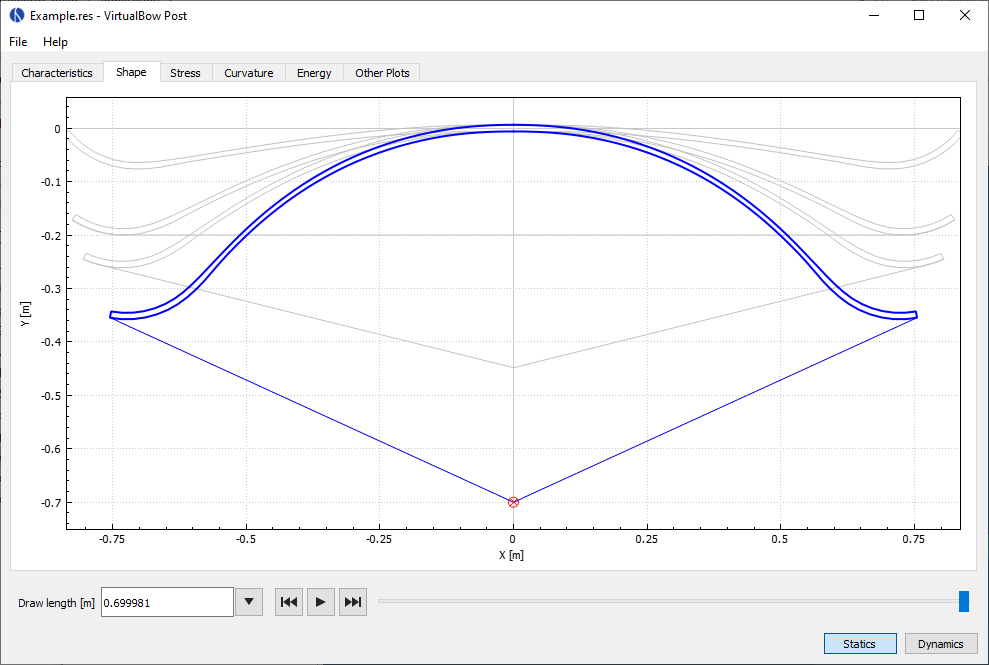

# Result Viewer

The result viewer opens automatically after a simulation and provides tools to explore the static and dynamic behaviour of the bow.
The buttons on the lower-right corner let you switch between static and dynamic results, if available.
All results are organized into tabs, which are described in the following sections.

<figure>
  
</figure>

Beneath the tabs is a slider that controls the current state of the bow being displayed.

- In **static** mode, the slider represents draw length

- In **dynamic** mode, it represents time

This setting applies across all tabs, though only some of them make use of it.
You can drag the slider to inspect a specific bow state or use the playback controls to animate the simulation continuously.
The input field and dropdown menu next to the slider allow you to jump directly to key points in the results.
