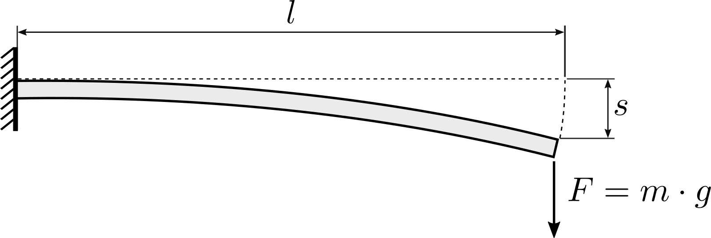
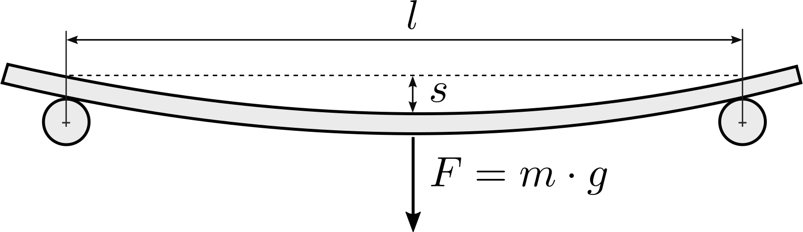

# Bending Test

A bending test is a good way to experimentally determine Young's modulus $E$ of a material.
The starting point is a material sample with a constant width $w$ and height $h$.
It is important that the dimensions, especially the height, are fairly precise, since they have a large influence on the final result.

The usable length $l$ of the sample should be much larger than the cross section dimensions such that it can bend enough for easy measuring while still staying in the elastic range of the material.
On the other hand, it shouldn't be so long that it bends significantly under its own weight.
A suggestion would be $l \ge 100 \cdot h$.

To perform the test, the sample is either clamped on one end, as shown in [Clamped setup](#clamped-setup), or placed between two supports as shown in [Three-point setup](#three-point-setup).
It is then subjected to a force $F$ and the resulting deflection $s$ is measured.
Finally, Young's modulus can be calculated from the measured deflection depending on the chosen setup.

A good way to apply an accurate force is to use a known weight $m$, suspended for example on a thread, and calculate the force as $F = m \cdot g$ with $g = 9.81\,\frac{\mathrm{m}}{\mathrm{s}^2}$.
Alternatively, an accurate bow/hanging scale might also work.

## Clamped setup

<figure style="--img-width: 450px">

</figure>

In this setup the sample is clamped on one end and the force is applied on the free end.
Young's modulus can be calculated as

$$E = \frac{Fl^3}{3Is} = \frac{4Fl^3}{wh^3 s}$$

## Three-point setup

<figure style="--img-width: 400px">

</figure>

In this setup the sample is placed between two rolling supports with distance $l$ and the force is applied in the middle.
Young's modulus can be calculated as

$$E = \frac{Fl^3}{48Is} = \frac{Fl^3}{4wh^3 s}$$
