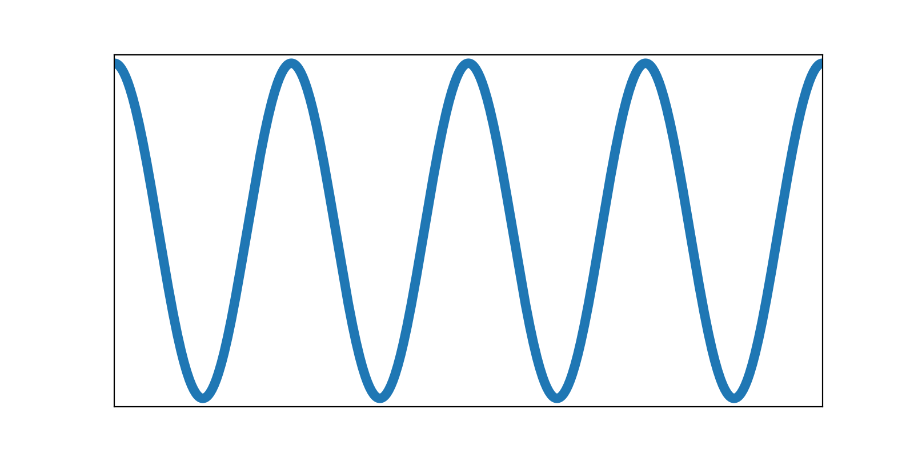
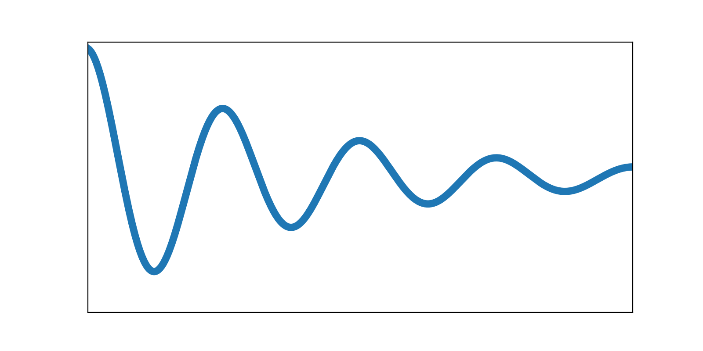
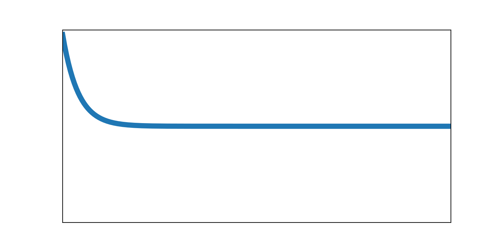

#  Damping

Damping accounts for energy dissipation, such as losses caused by internal friction or hysteresis in the materials.
It affects only the dynamic analysis.

A typical bow loses only a small part of its efficiency to energy dissipation.
Most of its losses come instead from kinetic energy that remains in the bow after the arrow leaves the string.
For this reason, the damping parameters are not critical for modeling overall bow performance.
They do however make the behavior of the bow after the shot more realistic, since without damping the bow's motion would never decay.

Because modeling every form of energy dissipation in a bow in an exact way would be far too complex, the damping is reduced to two empirical values:
the damping ratio of the **Limbs** and the damping ratio of the **String**.
The [damping ratio](https://en.wikipedia.org/wiki/Damping) describes how quickly oscillations decay over time:

- A damping ratio of 0% represents an undamped system: no energy is lost, and the oscillation just keeps going with a constant amplitude.

- As the damping ratio increases, the oscillation decays more quickly, losing energy with each cycle.

- At 100%, the system is *critically damped*: oscillations no longer occur and the system returns to equilibrium without overshoot.

See the table below for a visualization of these three cases.
The damping ratios of a bow's limbs and string are largely empirical, and there is still limited practical experience with them.
Realistic values are probably in the range of **1–10%**, though.
You can observe the damping behavior of your bow's limbs by clamping the handle firmly on a table or workbench and plucking the limb tip.
The longer it continues to oscillate, the lower the damping ratio.

 

| Damping ratio | Oscillation                                                                                                     |
|---------------|-----------------------------------------------------------------------------------------------------------------|
| 0%            |  |
| 10%           |  |
| 100%          |  |
