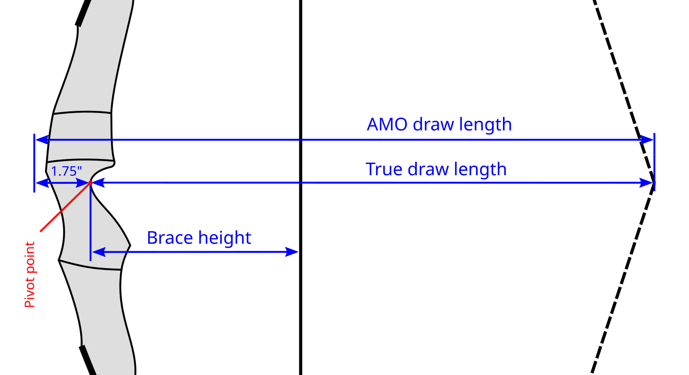

#  Draw

This section defines the brace height and draw length at which the bow is operated.
Both values reference the bow's pivot point, which is configured in the [Handle](model-editor-handle.md) section, so they only become meaningful once the handle has been properly set up.
See also the figure below for a visual definition of each parameter.

**Brace height:** The brace height is measured as the distance between the bowstring and the handle's pivot point on the braced bow.
VirtualBow automatically determines the string length required to achieve the specified brace height.

**Draw length:** The bow's draw length can be specified according to two conventions.
Choosing between them is purely a matter of preference and convenience; it has no other effect.

- **Standard:** Under the *Standard* convention, the draw length is defined as the distance between the handle's pivot point and the string at full draw — sometimes referred to as the *true* draw length.

- **AMO:** The alternative is the *AMO* convention, defined by the *Archery Manufacturers Organization*, where the draw length is taken as the pivot-to-string distance plus 1.75 inches.
This definition is widely used by bow manufacturers.

 
<figure style="--img-width: 600px">

  <figcaption><b>Figure:</b> Definition of the brace height and draw length in both conventions.</figcaption>
</figure>