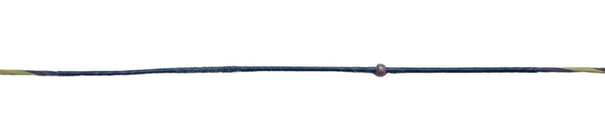
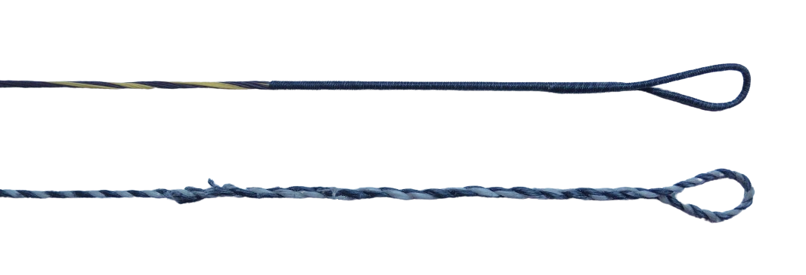
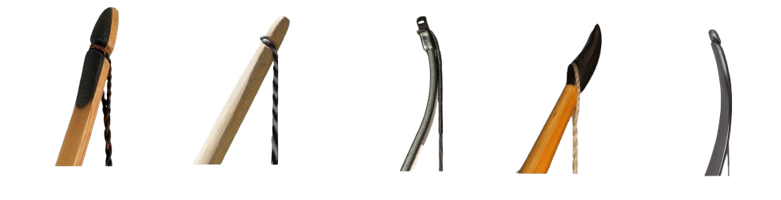

#  Masses

Here you can set the mass of the arrow as well as additional masses placed on the bow or the string.
Only the arrow mass is required; the others are optional and may be set to zero if not needed.

**Arrow:** The mass of the arrow can be specified in one of three ways:

- **Mass:** The absolute mass of the arrow in grams, grains or any other selected unit.

- **Mass per force:** To compare bow/arrow setups of different draw weight, arrow mass is often expressed relative to the bow's draw weight, typically in grains per pound (GPP). When you specify the arrow mass in this way, VirtualBow calculates the actual mass after the static simulation, once the bow's draw force is known.

- **Mass per energy:** The established method of defining arrow mass relative to draw force has one limitation: it does not account for the bow's power stroke or the shape of its force-draw curve.
As a result, it is not a good metric for comparing bows with different energy storage characteristics.
For example, a 10 gpp arrow on a bow with a 26" draw length is a very different setup from a 10 gpp arrow on a 30" draw length: both produce the same arrow mass for a given draw force, even though the longer draw stores significantly more energy and would therefore require a heavier arrow.
The same problem arises when comparing, for example, a longbow and a recurve bow since they store different amounts of energy even at the same draw force and power stroke.
To address these issues, VirtualBow offers an alternative definition of the arrow mass relative to the bow's stored energy, suggested to be measured in grains per joule (GPJ).
When you specify the arrow mass in this way, VirtualBow calculates the actual mass after the static simulation, once the bow's force-draw curve and stored energy are known.
A conversion table between GPP and GPJ is provided below to give you a sense of typical values.

**String center:** Additional masses located near the center of the string, typically the center serving and any nocking point(s).
The image below shows a typical center serving with a single brass nocking point.

<figure style="--img-width: 600px">

</figure>

**String end:** Additional masses located near the ends of the string, typically the serving on the ears of an endless-loop string or the doubled-up splice section on a Flemish twist string.
See the image below for examples of both types.

<figure style="--img-width: 600px">

</figure>

**Limb tip:** There is a wide variety of limb tip designs; a few examples are shown below.
What they all share is that they add some mass to the end of the limb, which can be represented by this value.
The added mass typically consists of the small portion of the limb extending beyond the string attachment point, along with any reinforcing elements such as tip overlays or similar.

<figure style="--img-width: 600px">

</figure>

 

> [!NOTE]
> This table shows the equivalent GPJ (grains per joule) value for each combination of GPP (grains per pound) and power stroke, estimated based on the assumption of a linear force-draw curve.
>
> | GPP | 18"  | 19"  | 20"  | 21"  | 22"  | 23"  | 24"  |
> |-----|------|------|------|------|------|------|------|
> | 1   | 1.0  | 0.9  | 0.9  | 0.8  | 0.8  | 0.8  | 0.7  |
> | 2   | 2.0  | 1.9  | 1.8  | 1.7  | 1.6  | 1.5  | 1.5  |
> | 3   | 3.0  | 2.8  | 2.7  | 2.5  | 2.4  | 2.3  | 2.2  |
> | 4   | 3.9  | 3.7  | 3.5  | 3.4  | 3.2  | 3.1  | 3.0  |
> | 5   | 4.9  | 4.7  | 4.4  | 4.2  | 4.0  | 3.8  | 3.7  |
> | 6   | 5.9  | 5.6  | 5.3  | 5.1  | 4.8  | 4.6  | 4.4  |
> | 7   | 6.9  | 6.5  | 6.2  | 5.9  | 5.6  | 5.4  | 5.2  |
> | 8   | 7.9  | 7.5  | 7.1  | 6.7  | 6.4  | 6.2  | 5.9  |
> | 9   | 8.9  | 8.4  | 8.0  | 7.6  | 7.2  | 6.9  | 6.6  |
> | 10  | 9.8  | 9.3  | 8.9  | 8.4  | 8.0  | 7.7  | 7.4  |
> | 11  | 10.8 | 10.2 | 9.7  | 9.3  | 8.9  | 8.5  | 8.1  |
> | 12  | 11.8 | 11.2 | 10.6 | 10.1 | 9.7  | 9.2  | 8.9  |
> | 13  | 12.8 | 12.1 | 11.5 | 11.0 | 10.5 | 10.0 | 9.6  |
> | 14  | 13.8 | 13.0 | 12.4 | 11.8 | 11.3 | 10.8 | 10.3 |
> | 15  | 14.8 | 14.0 | 13.3 | 12.6 | 12.1 | 11.5 | 11.1 |
