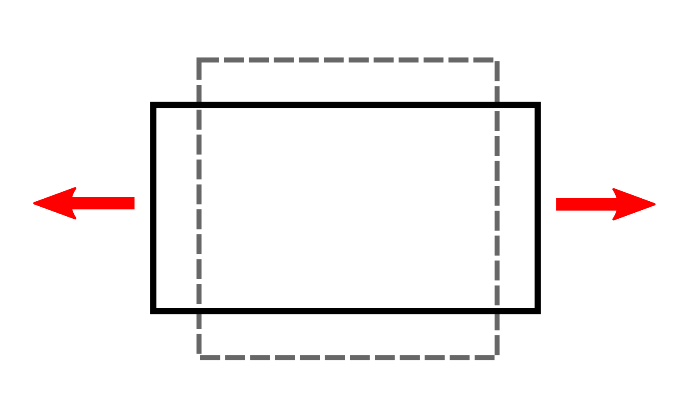
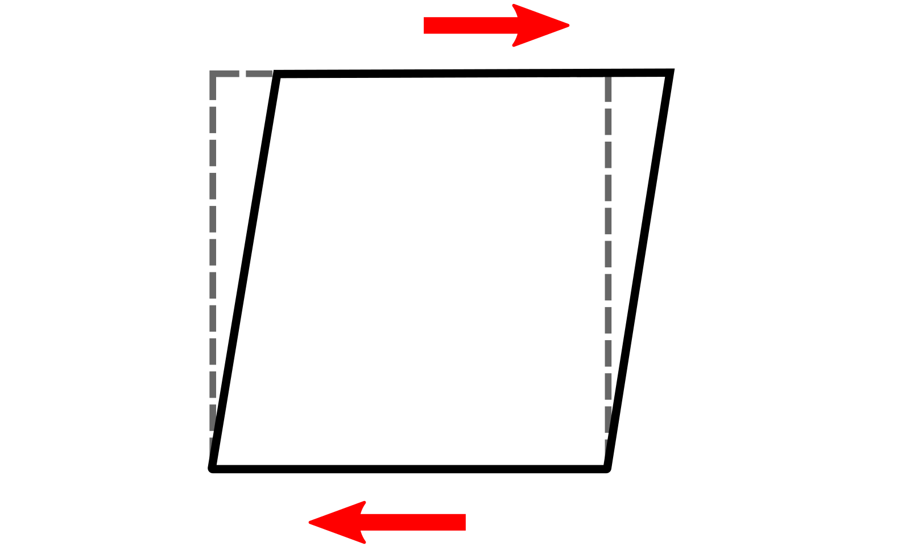

#  Materials

This item contains a list of all materials in the bow.
The layers, which are defined later, each reference one of these materials, and several layers can share the same material.

<figure style="--img-height: 220px">

  <figcaption><b>Figure:</b> Materials in the model tree</figcaption>
</figure>

If the _Materials_ category in the model tree is selected, the buttons (, , , ) can be used to add, remove and reorder materials.
Materials can be renamed by double-clicking and entering a new name.
Selecting a material from the list opens its associated material properties.
They are grouped into *General*, *Elastic* and *Strength* properties.
The elastic material properties define how the material deforms under load, while the strength properties define the material's failure limits.

## General

**Color:** The material can be given any color desired to make it look a bit more realistic.
It has no effect other than on the appearance of the bow.

**Density:** The density of a material is defined as its mass per unit volume.

## Elastic

<b>Young's modulus:</b> A material's Young's modulus, usually denoted $E$, describes its stiffness against normal (tensile or compressive) loading.
It is defined as the ratio of normal stress to normal strain.
This assumes <i>linear elasticity</i>, meaning stress and strain are proportional.
Many common materials follow such a linear relationship up to a certain limit.

<b>Shear modulus:</b> The shear modulus, usually denoted $G$, is similar to Young's modulus in that it characterizes the stiffness against deformation.
Unlike Young's modulus, which relates to normal deformation, it describes how the material responds to shear deformation.
VirtualBow does not make much use of the shear modulus yet, but it will form the basis for future features such as modeling the limbs' torsional rigidity.
If you do not know the exact value for your material, you can estimate it as roughly one-third to one-half of Young's modulus.
If the material's <i>Poisson ratio</i> $\nu$ is known instead, the shear modulus can be computed from the relation $G = E/(2(1 + \nu))$.

## Strength

**Tensile strength:** The tensile strength defines the maximum normal stress a material can withstand while under tension.
Beyond this limit, the material will fail or permanently deform.
In VirtualBow, this value is used to assess whether any part of the limb experiences tensile stresses that exceed the material's allowable limits.

**Compressive strength:** The compressive strength specifies the maximum normal stress a material can sustain while being compressed.
Beyond this limit, the material will fail or permanently deform.
In VirtualBow, this value is used to assess whether any part of the limb experiences compressive stresses that exceed the material's allowable limits.

**Margin of safety:** The margin of safety (MoS) defines how conservatively the material's strength limits are applied.
It reduces the allowable stresses so that the bow operates with some reserve against the actual failure thresholds.
The margin of safety indicates by what percentage the allowable stress could increase before reaching the failure stress:

$$\sigma_{\mathrm{failure}} = \sigma_{\mathrm{allowed}} \times (100\% + \mathrm{MoS})$$

A higher margin of safety leads to more conservative designs, reducing the risk of material failure but also potentially leaving some of the material's performance on the table.

> [!NOTE]
> For synthetic materials such as fiber-reinforced composites, the mechanical properties are often provided in a manufacturer's datasheet.
> Natural materials like wood are more challenging, as their properties can vary quite a bit.
> Average numbers can be found at [The Wood Database](https://www.wood-database.com) and other websites, which should provide a good baseline.
> As an alternative, you can determine some of the properties experimentally by a bending test.
> For details on that see [Appendix B](appendix-bending-test.md).

> [!NOTE]
> In this section, several concepts from the mechanics of materials — such as stresses and strains — have been introduced without much explanation.
> This is not to suggest that these topics are common knowledge; covering them thoroughly here would simply be beyond the scope of this manual.
> If you want to dive in deeper, the list below provides some links to videos that explain these concepts in greater detail.
> - [An Introduction to Stress and Strain](https://www.youtube.com/watch?v=aQf6Q8t1FQE)
> - [Understanding Young's Modulus](https://www.youtube.com/watch?v=DLE-ieOVFjI)
> - [Understanding Poisson's Ratio](https://www.youtube.com/watch?v=tuOlM3P7ygA)
> - [Understanding Material Strength, Ductility and Toughness](https://www.youtube.com/watch?v=WSRqJdT2COE)
