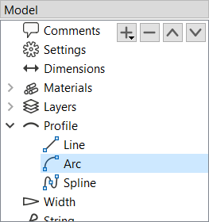
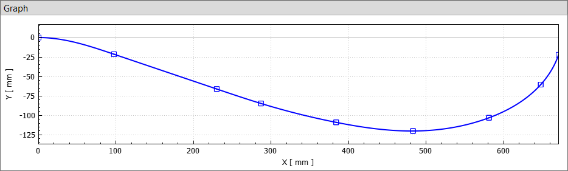
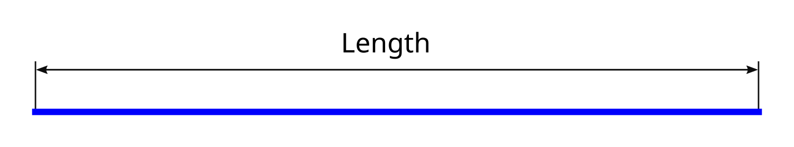
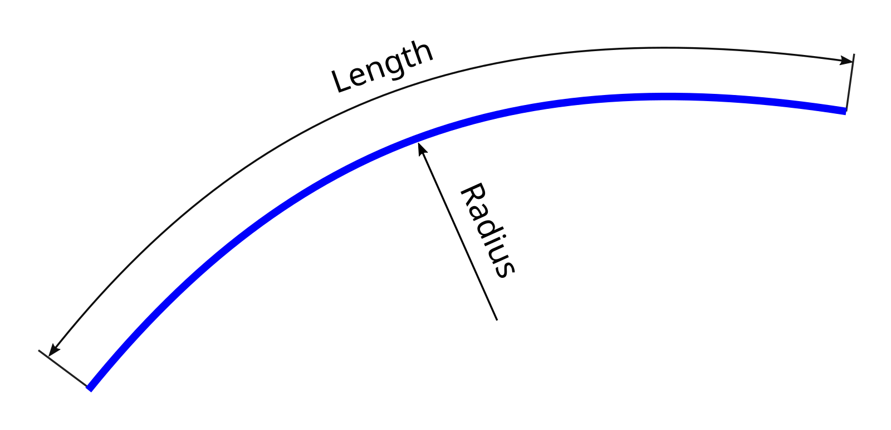
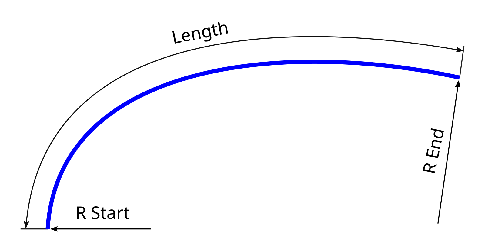
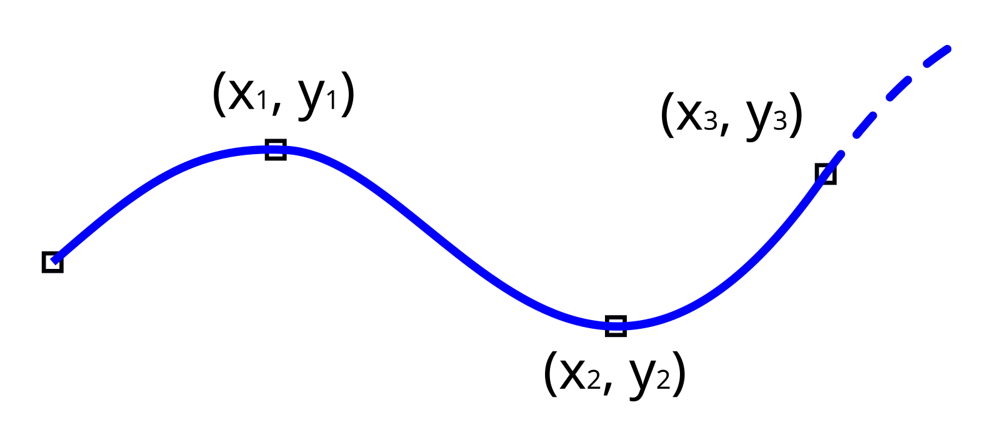

#  Profile

The profile defines the shape of the bow in its unbraced state.
It establishes the limb's base curvature before any string tension is applied, and therefore determines the fundamental design of the bow — such as a straight longbow form, reflex/deflex, recurve, or any other variation.

<figure style="--img-width: 200px">

  <figcaption><b>Figure:</b> Profile segments in the model tree</figcaption>
</figure>

If the _Profile_ category in the model tree is selected, the buttons (, , , ) can be used to add, remove and reorder the segments that make up the profile curve (such as lines, arcs, and other types).
The properties available for each segment depend on its type and are described below.
The resulting profile shape is displayed in the _Graph_ panel.
The plot's context menu provides additional options, such as showing or hiding control points, displaying curvature, or adding an overlay image.

<figure style="--img-width: 800px">

  <figcaption><b>Figure:</b> Profile plot</figcaption>
</figure>

## Line segments

A line segment represents a straight section of the profile.
Its only adjustable property is its **length**.

<figure style="--img-width: 500px">

  <figcaption><b>Figure:</b> Line segment properties</figcaption>
</figure>

## Arc segments

An arc segment represents a circular arc defined by its **length** and **radius**.
The radius may be positive or negative, which determines the direction in which the arc curves.
A radius of zero will be interpreted as a straight line instead.

<figure style="--img-width: 400px">

  <figcaption><b>Figure:</b> Arc segment properties</figcaption>
</figure>

## Spiral segments

A spiral segment represents an [Euler spiral](https://en.wikipedia.org/wiki/Euler_spiral), a curve whose curvature changes linearly along its length.
This makes it ideal for creating smooth transitions between straight lines and arcs, or between arcs of different radii.
It is defined by a **start radius**, an **end radius**, and a **length**.
Both the start and end radius may be positive, negative, or zero, allowing the spiral's endpoints to curve in either direction or transition seamlessly into straight sections.

<figure style="--img-width: 400px">

  <figcaption><b>Figure:</b> Spiral segment properties</figcaption>
</figure>

## Spline segments

A spline segment interpolates a series of `(x, y)` points using a cubic spline curve.
The coordinates are specified relative to the segment's starting point (i.e. the end point of the previous segment, if present).

<figure style="--img-width: 400px">

  <figcaption><b>Figure:</b> Spline segment properties</figcaption>
</figure>
