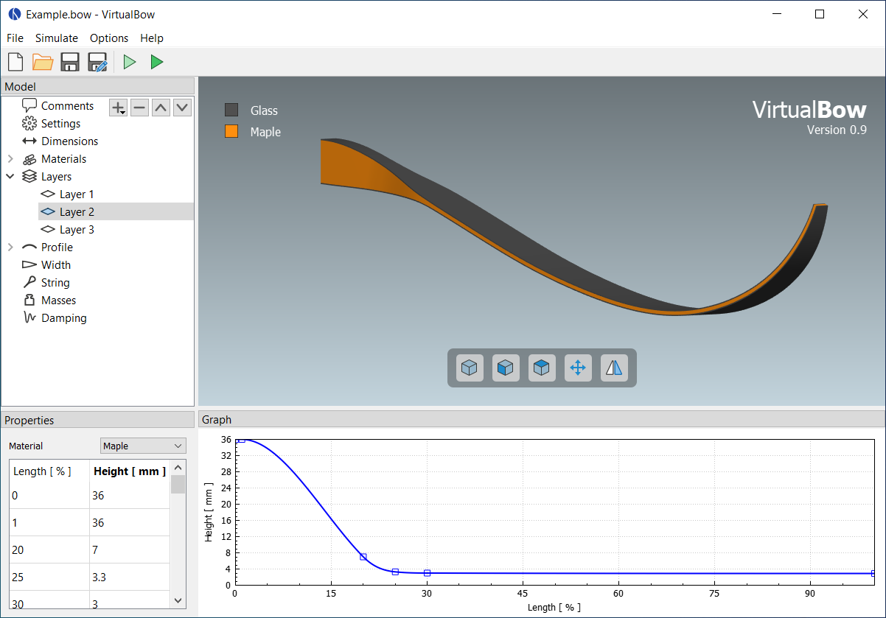

# Model Editor

The model editor is the first thing you will see when opening VirtualBow.
It serves as the central workspace where you create and refine your bow designs.
Here you can specify shape and dimensions, adjust material properties, and configure all other parameters that affect the bow's behavior.
Once the model is set up, you can launch simulations to evaluate the performance of your design.

<figure style="--img-width: 90%">

  <figcaption><b>Figure:</b> Screenshot of the model editor</figcaption>
</figure>

## Loading and saving files

Use the file menu or the toolbar buttons at the top to create, open, and save bow models.
These models are stored on disk as `.bow` files, which contain all physical and geometric parameters of the design.
You can share these files with other users, who can then open them in VirtualBow to inspect or work with your models.

> [!NOTE]
> New versions of VirtualBow often introduce internal changes to the `.bow` file format.
> The software aims to remain compatible with older files whenever possible, so you can still open models created with earlier releases (currently down to version `0.7`).
> When you save such a file again, VirtualBow automatically converts it to the current format and creates a backup with a `.bak` extension in case anything goes wrong.
> After opening an older `.bow` file, it's a good idea to review the model to ensure that the conversion was successful.

## Editing the bow model

The main area of the editor displays a 3D visualization of the bow's current geometry.
You can rotate the view with the left mouse button, pan with the middle button, and zoom using the mouse wheel.
Additional view controls are available through the buttons at the bottom of the window.
Alongside the 3D view, the editor interface includes three panels:

**Model:** The model tree in the top-left corner shows how the bow model is organized, grouping its various physical and geometric properties.
Selecting an item in the tree displays its details in the _Properties_ and/or _Graph_ panels. Some categories — such as _Materials_, _Layers_, and _Profile_ — can be edited directly in the tree by adding, removing, or renaming items.

**Properties:** The property editor displays the properties of the currently selected item in the model tree.
Here you can inspect and modify the physical and geometric parameters of the bow model.

**Graph:** The graph panel displays any plots associated with the selected item in the model tree.
These graphs update automatically as you adjust the corresponding properties, providing visual feedback.

> [!NOTE]
> You can change the physical units used throughout the model editor under _Options_ → _Units_.

## Running simulations

Simulations can be started from the _Simulate_ menu or by clicking one of the toolbar buttons.
Once a simulation has finished, the results open in a separate result viewer window.
There are two simulation modes:

 **Statics**:
The static simulation analyzes the bow as it is drawn from brace height to full draw.
Among other characteristics, the results include the force-draw curve.
This mode is called _static_ because the bow is considered to be in static equilibrium at each stage of the draw.

 **Dynamics**:
The dynamic simulation analyzes the bow and arrow in motion as the string is released from full draw.
It provides results such as arrow speed and efficiency.
Because it requires the initial state of the bow at full draw, every dynamic simulation is automatically preceded by a static simulation.
