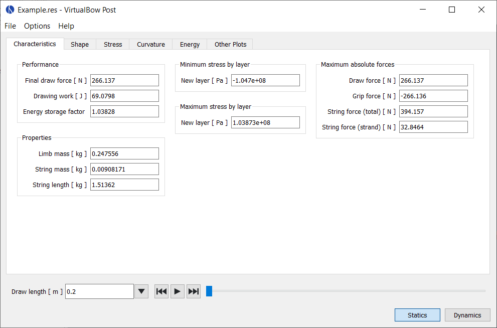
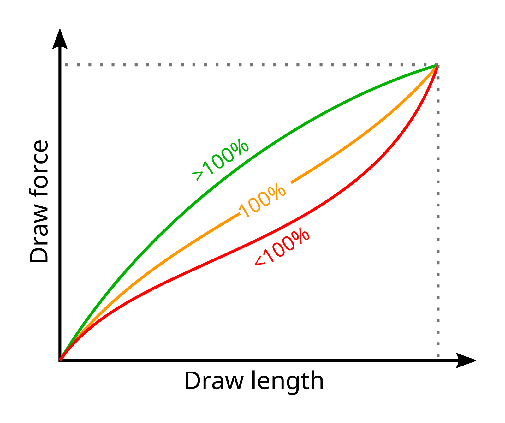

# Characteristics

This tab lists all results that can be expressed as single numerical values.
Some of these values apply only to static or only to dynamic analysis, while others are shared between both modes.

<figure style="--img-width: 90%">

</figure>

## Common

**Maximum stresses:** Shows the maximum tensile and compressive stress that occurred in each layer during the simulation.
The fields are color-coded to indicate how these stresses compare to the material limits and the defined safety margin:

- **Green** indicates that the maximum stress is within the allowed range, based on the material's tensile and compressive strength and the chosen margin of safety.

- **Orange** means the stress exceeds the safe range defined by the margin of safety, but is still below the material's ultimate strength.

- **Red** signals that the stress has surpassed even the ultimate strength of the material.

**Maximum strains:** Shows the maximum tensile and compressive strains that occurred in each layer during the simulation, using the same color-coding scheme as the maximum stresses.
Because stress and strain are directly linked, the maximum strains do not introduce any new information about potential material failure.

**Maximum absolute forces:** This section reports the highest values reached during the simulation for selected forces in the bow.

- **Draw force:** Only shown in static analysis. The maximum draw force reached during the draw cycle (which may be different from the final force at full draw).

- **Grip force:** The maximum push or pull force required to keep the bow's handle stationary during the simulation.

- **String force:** The maximum tensile force acting on the bowstring, shown as the total force or resolved by strand.

## Statics

**Final draw force:** The force required to hold the bow at full draw.
This value is commonly referred to as the bow's draw weight.

**Drawing work:** The total mechanical energy put into the bow while drawing it.
This energy is stored in the limbs as elastic potential energy and later only partly passed on to the arrow, depending on the bow's efficiency.
It corresponds to the area under the bow's force-draw curve.

**Energy storage factor:** This value indicates how effective the bow's force-draw curve is at storing energy.
It is defined as the ratio between the actual energy stored in the bow and the energy that <i>would</i> be stored if the draw curve were perfectly linear.
A curve that bulges above the linear reference has a higher storage factor, because it accumulates more energy for the same final draw force.

<ul>
  <li><b>Factor &lt; 100%:</b> The bow stores less energy than a linear draw curve would allow. This is generally undesirable and might indicate stacking towards the end of the draw.</li>
  <li><b>Factor = 100%:</b> The bow stores exactly as much energy as a linear draw curve would. Values near 100% are common for longbows and similar designs.</li>
  <li><b>Factor &gt; 100%:</b> The bow stores more energy than a linear draw curve would. This gives it additional stored energy at the same final draw weight, potentially improving its performance. Well-designed recurve bows, for example, should be firmly in this category.</li>
</ul>

**Limb mass:** The total mass of a single bow limb, calculated from its geometry and material properties.
Any additional masses at the limb tips are included in this value.

**String mass:** The total mass of the bowstring, calculated from its length and material properties.
Any additional masses are included in this value.

**String length:** The length of the string as determined by the simulation in order to achieve the specified brace height.

**Power stroke:** The distance from brace height to full draw.
It represents the portion of the draw over which the bow accelerates the arrow.

## Dynamics

**Arrow mass:** This is either the explicitly specified mass of the arrow, or the computed arrow mass according to the desired mass per force or mass per energy ratio.

**Final arrow velocity:** Final velocity of the arrow when it leaves the bow.

**Final arrow energy:** Final kinetic energy of the arrow when it leaves the bow.

**Degree of efficiency:** Describes how effectively the bow converts input energy into useful output.
It is the ratio between the final kinetic energy of the arrow and the drawing work put into the bow.
Higher efficiency indicates that a greater portion of the stored energy is delivered to the arrow rather than lost to other effects.

**Efficiency losses:** The degree of efficiency indicates what portion of the bow's input energy is transferred to the arrow.
This section shows how the remainder of that energy is distributed at the time the arrow leaves the string.
For each component, both the absolute energy loss and its contribution to reducing overall efficiency are listed.
The categories are **kinetic** and **elastic** energy remaining in the limbs and string after the arrow has left the string, as well as energy lost to **damping** up to that moment.

> [!NOTE]
> The elastic energy of the limb often appears as a negative value.
> This does not mean the limb adds energy to the system.
> The reference point for the limb's elastic energy, at least for this calculation, is its equilibrium state at brace height.
> At the moment the arrow leaves the string, the limb is abruptly slowed by the tension in the string.
> Because the string is elastic, it allows the limb to overshoot its braced position slightly, reducing its elastic energy below the reference level and producing a negative value.
> The string's elastic energy increases correspondingly and no physical laws are harmed in the process.
