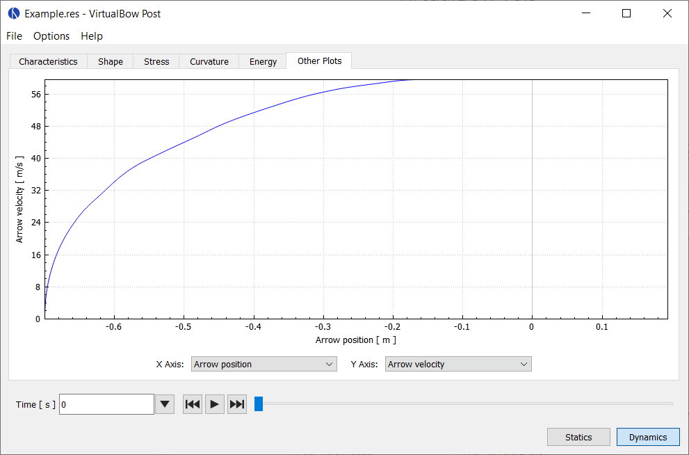

# Other Plots

This tab lets you combine any results from the simulation and plot them against one another.
It allows you to explore the data freely and visualize relationships that aren't covered by the default plots.
The available data series for static and dynamic analyses are listed below.

<figure style="--img-width: 90%">

</figure>

## Static analysis

| Data series               | Description                                                            |
|:--------------------------|:-----------------------------------------------------------------------|
| Power stroke              | Current distance of the string from its braced position                |
| Draw length               | Current draw length of the bow                                         |
| Draw force                | Current draw force of the bow                                          |
| Draw stiffness            | Stiffness of the draw, i.e., force increase per increase in draw length |
| String force (total)      | Total tensile force in the string                                      |
| String force (strand)     | Tensile force per individual strand                                    |
| String length             | Current length of the string, including elastic stretch                |
| String tip angle          | Angle between the limb tip and the string                              |
| String center angle       | Angle at the center of the string                                      |
| Grip force                | Force required to hold the grip                                        |
| Elastic energy limbs      | Elastic energy of the limbs                                            |
| Elastic energy string     | Elastic energy of the string                                           |

## Dynamic analysis

| Data series               | Description                                             |
|:--------------------------|:--------------------------------------------------------|
| Time                      | Time elapsed since release                              |
| Arrow position            | Position of the arrow                                   |
| Arrow velocity            | Velocity of the arrow                                   |
| Arrow acceleration        | Acceleration of the arrow                               |
| String force (total)      | Total tensile force in the string                       |
| String force (strand)     | Tensile force per individual strand                     |
| String length             | Current length of the string, including elastic stretch |
| String tip angle          | Angle between the limb tip and the string               |
| String center angle       | Angle at the center of the string                       |
| Grip force                | Force required to hold the grip                         |
| Elastic energy limbs      | Elastic energy of the limbs                             |
| Kinetic energy limbs      | Kinetic energy of the limbs                             |
| Elastic energy string     | Elastic energy of the string                            |
| Kinetic energy string     | Kinetic energy of the string                            |
| Kinetic energy arrow      | Kinetic energy of the arrow                             |
