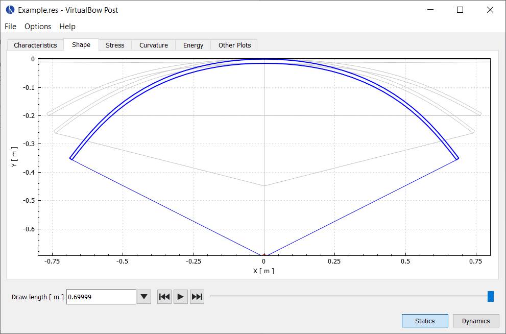

# Shape

The shape view displays the geometry of the limbs and string, along with the arrow's position, at different stages of the draw (for statics) or throughout the shot (for dynamics).
The small red circle marks the nock end of the arrow, and the blue cross marks the bow's pivot point.
You can use the slider at the bottom to move through the states or play them as a continuous animation.

<figure style="--img-width: 90%">

</figure>
