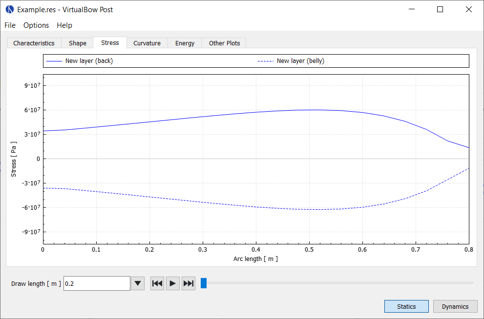

# Stress

This tab shows the distribution of bending stress for each layer along the length of the limb.
It helps identify regions of the limb that are overstressed and ones that are carrying less load than they could.

<figure style="--img-width: 90%">

</figure>

The bending stresses (tension and/or compression) vary linearly across the thickness of each layer.
Because of this, the extremes always occur at the layer boundaries.
The plot therefore shows two stresses per layer: one at the back side and one at the belly side.
Positive values represent tension, and negative values represent compression.
