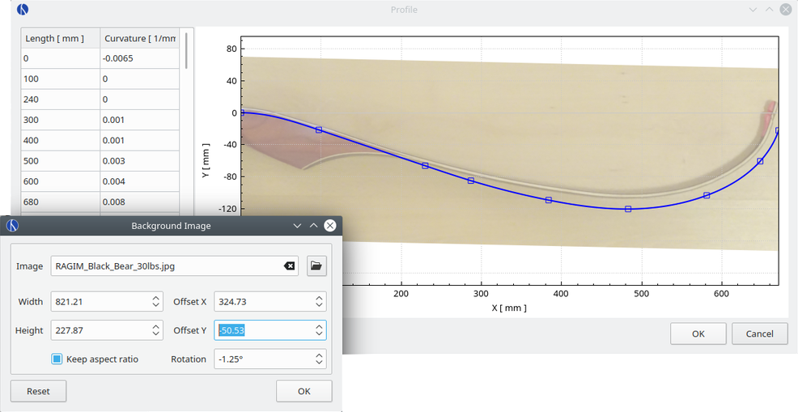

# Tips & Tricks

This section contains various notes about useful features of VirtualBow that didn't reall fit anywhere else in this manual.

## Units

Manually converting between units is tedious and error-prone.
That's why all inputs and outputs in VirtualBow have a configurable unit that can be changed under *Options* - *Units*.

<figure>
  
  <figcaption><b>Figure:</b> Unit selection dialog</figcaption>
</figure>

In this dialog you can select units for different categories of values.
Changing the unit for *Length*, for example, will change the unit everywhere where lengths are shown (e.g. width, layer height, dimensions).
There are also two pre-defined sets of defaults, one for SI units and one for US units.
You can use those by clicking either of the buttons on the bottom left.

It is worth noting that the units only affect how values are shown in the user interface.
The data in the model and result files is always stored in SI base units, so they can be exchanged with other users who might have different units preferences.

## Plots

**Background images**

Any plot can be given a background image.
After selecting *Background image...* in the plot's context menu, you can load an image and adjust its position and orientation.

<figure>
  
  <figcaption><b>Figure:</b> Table context menu</figcaption>
</figure>

This feature can be used to model existing bows more easily or to compare the simulation results with actual photographs.
Background images are only temporary, they are not saved with the model files.

**File exports**

Plots can be exported to various image and data formats using the menu entry *Export as...*.
Supported export formats are:

* PDF vector graphic

* PNG image

* BMP image

* CSV table

**Other options**

Some of the plots have additional context menu entries.
The proile plot, for example, has options to show or hide nodes or visualize the curvature.

## Number inputs

Number input fields may seem simple, but there are a few details worth knowing to use them more effectively.

<figure>
  
  <figcaption><b>Figure:</b> Number input field</figcaption>
</figure>

**Arithmetic expressions**

Most number input fields in VirtualBow accept arithmetic expressions.
This means that you can enter expressions like `1 + 5/2`, press enter, and it will be automatically evaluated to `3.5`.
Supported operations are `+`, `-`, `*`, `/`, `^` and grouping with `(` and `)`.

**Decimal separator**

VirtualBow uses a dot (`.`) as the decimal separator for numbers, regardless of local conventions.
However, since some countries use a comma (`,`) instead, their keyboard layouts have a comma on the number block, making it cumbersome to enter numbers with a dot.
Therefore the comma on the number pad is automatically converted to a dot, so that the number pad can be used normally.

**Scrolling**

The scroll wheel on the mouse can be used to move through a whole ranges of values quickly.
This is especially useful when editing the bow's geometry and observing the changes in the plots and the 3d view.

## Tables

Content in tables can be copied, cut, pasted and deleted using either the context menu or the standard shortcuts.
This also works between VirtualBow and other applications, like Excel or LibreOffice Calc.

<figure>
  
  <figcaption><b>Figure:</b> Table context menu</figcaption>
</figure>