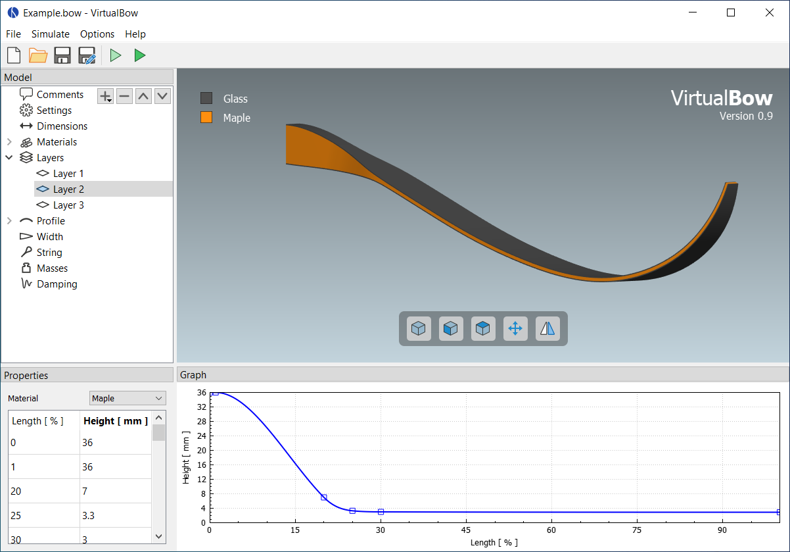

== Model Editor

The model editor is the first thing you will see when opening VirtualBow.
Here you can design your bows, specify their physical properties and start simulations to investigate their performance.

[#img-model-editor]
.Screenshot of the model editor

*Loading and saving files*

Use the file menu and/or the toolbar buttons on the top to create, open and save bow models.
Bow models are stored as `.bow` files on disk, which contain all the physical parameters of the bow.
You could share those files with other users and they would be able to open and view your creations.

NOTE: VirtualBow tries to keep compatibility with older `.bow` files as much as possible, so you should be able to open files that were created with older versions.
Keep in mind though that saving will overwrite the file in the new format.

*Editing the bow model*

The main view of the editor is a 3D visualization of the bow's current geometry.
Use the mouse to rotate (left button), shift (middle button) and zoom (mouse wheel) the perspective.
More view options are available through the buttons on the bottom.
Besides this 3D view, the editor interface contains three additional panels:

* *Model*: The model tree on the top left shows how the bow model is organized, with various categories of physical properties.
If an item in the model tree is selected, its details are shown in the _Properties_ and/or the _Graph_ panels.
Some categories in the tree can be edited by adding, removing or renaming items, namely _Materials_, _Layers_ and _Profile_.

* *Properties*: The property editor shows the details of the currently selected model tree item.
Here you can view and edit the physical properties of the bow model.

* *Graph*: The graph view will show any graphs/plots that are associated with the selected item in the model tree.
The graphs usually reflect the current properties and change as the properties are being edited.

The physical units that are used throughout the model editor can be changed under _Options_ - _Units_.

*Running Simulations*

Simulations can be started with the _Simuate_ menu or by clicking one of the toolbar buttons.
Any changes to the bow will be saved and the VirtualBow solver invoked on the model file.

* image:images/icons/run-statics.svg[width=24] *Statics*:
The static simulation analyzes the bow as it is being drawn from brace height to full draw.
One of the results is the force/draw curve, for example.
This mode is called static since the bow is considered to be in static equilibrium at each stage of the draw.

* image:images/icons/run-dynamics.svg[width=24] *Dynamics*:
The dynamic simulation analyzes the bow and arrow in motion as the string is released from full draw.
It adds things like arrow speed and degree of efficiency to the results.
Since it requires the initial state of the bow at full draw, the dynamic simulation will always perform a static simulation as well.

The simulation results are stored as a `.res` file next to the model file and automatically opened in the result viewer for analysis.

<<<
=== Comments

The comments are the first item in the model tree and are meant for documentation.
Any notes about the bow, its paramters or the simulation results can be added here.

[#img-comments]
.Screenshot of the comments
image::images/screenshots/editor/comments.png[width=250, pdfwidth=40%]

<<<
=== Settings

The settings can be used for tweaking the simulation.
Usually the default values should be fine though, so if you're reading this manual for the first time you might want to skip this section.

[#img-settings]
.Screenshot of the settings
image::images/screenshots/editor/settings.png[width=250, pdfwidth=40%]

Since the default settings are meant to be a good general choice, they favor accuracy and reliability over simulation speed.
So for specific use cases it could make sense to find more efficient settings.
Think about running a large number of scripted simulations, for example.
On the other hand, even the default settings might sometimes fail with certain bow designs such that different settings have to be used.

The settings are divided into general settings that affect both simulation modes as well as specific settings for the static and dynamic simulations.

*General*

* *Limb elements:* Number of finite elements that are used to approximate the limb. More elements increase the accuracy but also the computing time.

* *String elements:* Number of finite elements that are used to approximate the string. This number can usually be reduced if the bow has no recurve. In the case of a static analysis with no recurve it can even be set to one without losing any accuracy.

*Statics*

* *Draw steps:* Number of steps that are performed by the static simulation from brace height to full draw. This determines the resolution of the static results. You can usually decrease this value to speed up the simulation, especially if you're only interested in the dynamic results.

*Dynamics*

* *Arrow clamp force:* The force that the arrow has to overcome in order to separate from the string.
This value is chosen fairly small by default and can improve the simulation results for very light arrows.

* *Time span factor:* This factor controls the time period that is being simulated. A value of 1 corresponds to the time at which the arrow passes the brace height. The default value is larger than that in order to capture some of the things that tend to happen after the arrow left the bow (e.g. the maximum forces/stresses on limb and string).

* *Time step factor:* When simulating the dynamics of the bow, the program will repeatedly use the current state of the bow at time stem:[t] to calculate the next state at time stem:[t + \Delta t] where stem:[\Delta t] is some small timestep. We want this timestep to be as large as possible to keep the required number of steps low. But it still has to be small enough to get an accurate and stable solution. The program will try to estimate this optimal timestep, but to be on the safe side the estimation is multiplied with a factor between 0 and 1 that you can choose here.

* *Sampling rate:* The sampling rate limits the time resolution of the dynamic results. This is done because the dynamic simulation usually produces much finer grained data than is actually useful. Not including all of that in the final output reduces the size of the result files and the simulation time.

<<<
=== Dimensions

The dimensions define some overall lengths and angles of the bow, including an optional stiff middle section.

[#img-dimensions]
.Screenshot of the dimensions
image::images/screenshots/editor/dimensions.png[width=250, pdfwidth=40%]

See also <<#img-dimensions-definition>> for a visual definition of the dimensions.

*Draw*

* *Brace height:* Distance between the deepest point of the handle and the string at rest
* *Draw length:* Distance between the deepest point of the handle and the string at full draw

*Handle*

* *Length:* Optional length of a stiff middle section (grip/riser) between the limbs
* *Setback:* Distance between the deepest point of the grip and the attachment point of the limbs to the middle section
* *Angle:* Angle at which the limbs are attached to the middle section

[#img-dimensions-definition]
.Definition of the dimensions
image::images/dimensions.svg[width=250, pdfwidth=40%]

<<<
=== Materials

This is a list of materials that can later be assigned to the layers of the bow.

[#img-materials]
.Materials in the model tree and their properties
image::images/screenshots/editor/materials.png[width=500, pdfwidth=60]

If the _Materials_ category in the model tree is selected, the buttons (image:images/icons/list-add.svg[width=16], image:images/icons/list-remove.svg[width=16], image:images/icons/list-move-up.svg[width=16], image:images/icons/list-move-down.svg[width=16]) can be used to add, remove and reorder materials.
Materials can be renamed by double-clicking and entering a new name.
For each material, the following properties are needed:

* *Color:* Color used for display
* *Rho:* Density (mass per unit volume)
* *E:* Elastic modulus (measure of stiffness)

For synthetic materials like e.g. fiber-reinforced composites you can often find the mechanical properties in a datasheet provided by the manufacturer.
Natural materials like wood are more difficult, because their properties can vary quite a bit.
Average numbers can be found at http://www.wood-database.com and other websites, which should be a good starting point.
The alternative is to determine the material properties by experiment with a bending test.
For more information on that see <<bending-test>>.

<<<
=== Layers

Layers define the makeup of the bow in the thickness/height direction.
A bow can have multiple layers of different materials or only a single layer (self bows).

[#img-layers]
.Layers in the model tree
image::images/screenshots/editor/layers.png[width=250, pdfwidth=40%]

If the _Layers_ category in the model tree is selected, the buttons (image:images/icons/list-add.svg[width=16], image:images/icons/list-remove.svg[width=16], image:images/icons/list-move-up.svg[width=16], image:images/icons/list-move-down.svg[width=16]) can be used to add, remove and reorder layers.
Layers can be renamed by double-clicking and entering a new name.

[#img-layer]
.Layer properties
image::images/screenshots/editor/layer.png[width=900, pdfwidth=90%]

Each layer consists of a material and a height/thickness distribution.
The material can be selected from the drop-down list, which shows the materials that were previously defined in the _Materials_ category.

The height distribution is defined by a table of relative length and height values.
Each table row must contain a relative length along the limb (from 0% to 100%) and the corresponding layer height.
The actual height distribution is constructed as a smooth curve (monotonic cubic spline) passing through the supplied values and is shown in the _Graph_ panel.

Layer heights can be zero over portions of the length. This is useful for modelling layers that don't cover the whole limb.
Common examples for this are fadeouts and tip wedges inserted for increased stiffness.

<<<
=== Profile

The profile defines the shape of the (back of the) bow in unbraced state.

[#img-profile]
.Profile segments in the model tree
image::images/screenshots/editor/profile.png[width=250, pdfwidth=40%]

If the _Profile_ category in the model tree is selected, the buttons (image:images/icons/list-add.svg[width=16], image:images/icons/list-remove.svg[width=16], image:images/icons/list-move-up.svg[width=16], image:images/icons/list-move-down.svg[width=16]) can be used to add, remove and reorder segments of different types that make up the profile curve (e.g. lines, arcs and more).
The properties of each segment depend on its type and are explained below.
The resulting shape of the profile curve is shown in the _Graph_ panel.

[#img-profile-plot]
.Profile curve
image::images/screenshots/editor/profile-plot.png[width=900, pdfwidth=90%]

NOTE: The profile curve always starts at (0, 0) and with a horizontal angle. Any offsets in the actual bow can be achieved with the parameters in <<#_dimensions>>.

[discrete]
==== Line Segments

The line segment is simply a straight line.
Its only editable property is the length of the line.

.Line segment properties
image::images/segment-line.svg[width=400, pdfwidth=50%]

[discrete]
==== Arc Segments

The arc segment describes a circular arc with given length and radius.

NOTE: The radius can be positive or negative, which makes the arc curve into different directions.
It can also be zero, in this case the arc turns into a straight line.

.Arc segment properties
image::images/segment-arc.svg[width=400, pdfwidth=50%]

[discrete]
==== Spiral Segments

The spiral segment describes an https://en.wikipedia.org/wiki/Euler_spiral[Euler spiral], a curve that linearly transitions between two curvatures.
It is therefore well suited for making smooth transitions between arcs of different radius or lines and arcs.
It is defined by a starting radius, and end radius and a length.

NOTE: As with the arc segment, the start and end radiuses can be positive, negative or zero.

.Spiral segment properties
image::images/segment-spiral.svg[width=400, pdfwidth=50%]

[discrete]
==== Spline Segments

The spline segment interpolates a table of `(x, y)` values with a cubic spline.
The values are relative to the starting point of the segment/the end point of the previous segment.

.Spline segment properties
image::images/segment-spline.svg[width=400, pdfwidth=50%]

<<<
=== Width

This defines the limb's width along its length.
The width is the same for all layers of the bow.

[#img-width]
.Width properties
image::images/screenshots/editor/width.png[width=900, pdfwidth=90%]

The width distribution is defined by a table of relative length and width values.
Each table row must contain a relative length along the limb (from 0% to 100%) and the corresponding width.
The actual width distribution is constructed as a smooth curve (monotonic cubic spline) passing through the supplied values and is shown in the _Graph_ panel.

<<<
=== String

The string is defined by its material properties and the number of strands being used.
Its length is determined automatically from the brace height that was set under _Dimensions_.

[#img-string]
.String properties
image::images/screenshots/editor/string.png[width=250, pdfwidth=40%]

The following three properties are required:

* *Strand density:* Linear density of a single strand (mass per unit length)

* *Strand stiffness:* Stiffness of a single strand (force per unit strain)

* *Number of strands:* Total number of strands in the string

NOTE: Mass and stiffness of the string can be important for dynamic analysis.
The effect on the static results however is small, provided that the stiffness is high enough to prevent significant elongation.

The linear density of a string material can be easily determined with an accurate scale (weight divided by length), the stiffness however is more difficult to obtain.
Manufacturers usually don't publish this number.
<<#tbl-string-materials>> shows the results of tensile tests for three common bow string materials.
They were done by the https://www.ditf.de/en/index/ditf.html[German Institutes for Textile and Fiber Research] in July 2018.

[#tbl-string-materials, cols="1,1,1,1,1", width=100%]
.Material properties for common string materials. The stiffness values are a linear estimation from breaking strength and elongation.
|===
| Material        | Density [kg/m] | Breaking strength [N] | Elongation at break [%] | Stiffness [N/100%]

| Dacron B50      | 370e-6         | 180                   | 8.5                     | 2118
| Fastflight Plus | 176e-6         | 318                   | 2.9                     | 10966
| BCY 452X        | 192e-6         | 309                   | 2.5                     | 12360
|===

<<<
=== Masses

Here you can set the mass of the arrow as well as some other optional masses.

[#img-masses]
.Mass properties
image::images/screenshots/editor/masses.png[width=250, pdfwidth=40%]

The properties that can be set here are

* *Arrow:* Mass of the arrow

* *String center:* Additional masses at the string center (e.g. serving, nocking point)

* *String tip:* Additional masses at the ends of the string (e.g. serving)

* *Limb tip:* Additional masses at the limb tips (e.g. tip overlays, extending nocks)

Only the mass of the arrow is required.
The other ones account for optional weights at various points of the bow and may be set to zero if not needed.
Masses in general only have an effect in dynamic analysis.

<<<
=== Damping

Damping allows to account for energy dissipation, for example due to internal friction/hysteresis of the materials.
It only has an effect in dynamic analysis.

[#img-damping]
.Screenshot of the damping dialog
image::images/screenshots/editor/damping.png[width=250, pdfwidth=40%]

Since modelling all the different forms of energy dissipation in a bow in an exact way would be too complex, the damping is reduced to two empirical values:
The damping ratio of the *Limbs* and the damping ratio of the *String*.

The damping ratio characterizes how quickly oscillations decay over time.
An oscillation with a damping ratio of 0% is undamped, it doesn't dissipate any energy and just keeps going with a constant amplitude.
The higher the damping ratio the faster the amplitudes decay over time, losing energy with each oscillation.
Once the damping ratio reaches 100% there is no longer any oscillation (no overshoot), this is called critical damping.
See <<#tbl-damping-ratio>> for a visual explanation of those three cases.

[#tbl-damping-ratio, cols="1,2", width=60%]
.Examples for different values of the damping ratio
|===
^.^| Damping ^.^| Amplitude

^.^| 0%      ^.^| image:images/damping-ratio-00.svg[width=200, pdfwidth=60%]
^.^| 10%     ^.^| image:images/damping-ratio-01.svg[width=200, pdfwidth=60%]
^.^| 100%    ^.^| image:images/damping-ratio-10.svg[width=200, pdfwidth=60%]
|===

NOTE: The damping ratios of a bow's limbs and string are mostly empirical and there isn't yet much practical experience.
Realistic values are probably in the range of 1 - 10% though.

NOTE: In more technical terms, the limb's damping ratio applies to its first eigenmode in unbraced state and the string's damping ratio applies to its first eigenmode in longitudinal direction.
