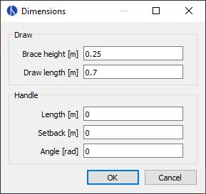
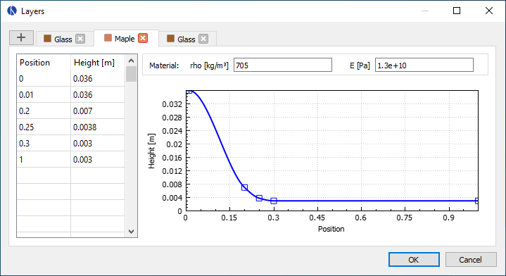
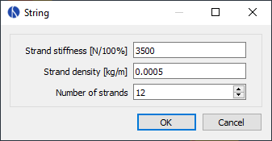

== Model Editor

With the model editor you can load, edit and save bow models and launch simulations.

[#img-model-editor]
.Screenshot of the model editor
image::images/screenshots/model-editor.png[width=600, pdfwidth=90%]

All the physical parameters of the bow can be accessed via the model tree on the left.
Double-click any of the items to edit the respective category.
The next sections will cover each of those items in more detail.

The 3D view on the right shows the current geometry of the bow.
Use the mouse to rotate (left button), shift (middle button) and zoom (mouse wheel).
More options are available through the buttons on the top-right corner.

Use the menu bar and/or the toolbar to create, load and save bow models, which are stored as `.bow` files.
Run a static simulation to analyze the bow being drawn or a dynamic simulation to analyze the bow in motion when released.
The simulation results will be stored next to the model file and automatically opened in the result viewer for analysis.

<<<
=== Comments

The comments are optional and can be used for documenting the bow model.
Any notes about the bow, its paramters or the simulation results can be added here.

[#img-comments]
.Screenshot of the comments dialog
image::images/screenshots/comments.png[width=400, pdfwidth=60%]

<<<
=== Settings

The settings can be used to tweak the simulation for better performance or accuracy.
Usually the default values should be fine though, so if you're reading this manual for the first time you might want to skip this section.

[#img-settings]
.Screenshot of the settings dialog
image::images/screenshots/settings.png[width=250, pdfwidth=40%]

Since the default settings are meant to be a good general choice, they favor accuracy and reliability over simulation performance.
So for specific use cases it could make sense to find more efficient settings.
Think about running a large number of scripted simulations, for example.
On the other hand, even the default settings might sometimes fail with certain bow designs such that different settings have to be used.

The settings are divided into general settings that affect both simulation modes as well as specific settings for the static and dynamic simulations.

==== General

* **Limb elements:** Number of finite elements that are used for the limb. More elements increase the accuracy but also the computing time.

* **String elements:** Number of finite elements that are used for the string. This number can usually be reduced if the bow has no recurve. In the case of a static analysis with no recurve it can even be set to one without losing any accuracy.

==== Statics

* **Draw steps:** Number of steps that are performed by the static simulation from brace height to full draw. This determines the resolution of the static results. You can usually decrease this value to speed up the simulation, especially if you're only interested in the dynamic results.

==== Dynamics

* **Arrow clamp force:** The force that the arrow has to overcome in order to separate from the string.
This value is chosen fairly small by default and can improve the simulation results for very light arrows.

* **Time span factor:** This factor controls the time period that is being simulated. A value of 1 corresponds to the time at which the arrow passes the brace height. The default value is larger than that in order to capture some of the things that tend to happen after the arrow left the bow (e.g. the maximum forces/stresses on limb and string).

* **Time step factor:** When simulating the dynamics of the bow, the program will repeatedly use the current state of the bow at time stem:[t] to calculate the next state at time stem:[t + \Delta t] where stem:[\Delta t] is some small timestep. We want this timestep to be as large as possible to keep the required number of steps low. But it still has to be small enough to get an accurate and stable solution. The program will try to estimate this optimal timestep, but to be on the safe side the estimation is multiplied with a factor between 0 and 1 that you can choose here.

* **Sampling rate:** The sampling rate limits the time resolution of the dynamic results. This is done because the dynamic simulation usually produces much finer grained data than is actually useful. Not including all of that in the final output reduces the size of the result files and the simulation time.

<<<
=== Dimensions

The dimensions define some overall lengths and angles of the bow, including an optional stiff middle section.

[#img-dimensions]
.Screenshot of the dimensions dialog

==== Definition

See the image below for the definition of the dimension parameters.

[#img-dimensions-definition]
.Definition of the dimensions
image::images/dimensions.svg[width=250, pdfwidth=40%]

<<<
=== Profile

The profile curve defines the shape of the bow's back in unbraced state.
Edit the parameters in the table on the left and view the resulting profile curve on the right.

[#img-profile]
.Screenshot of the profile dialog
image::images/screenshots/profile.png[width=600, pdfwidth=90%]

The profile curve is defined by a series of points where each point consists of an arc length and a curvature.
The arc length is the distance of the point along the curve.
Because of that, the last point also defines the total length of the profile curve.
The curvature is interpolated linearly between the points, which ensures that there are no jumps in curvature, only smooth transitions.

NOTE: The profile curve always starts at (0, 0) and with a horizontal angle. Any offsets in the actual bow can be achieved with the parameters in <<#_dimensions>>.

NOTE: Two points with zero curvature produce a straight line segment while two points with equal and non-zero curvatures produce a circular segment.
Two points with different curvatures produce a https://en.wikipedia.org/wiki/Euler_spiral[spiral segment] that transitions between the two curvatures.

NOTE: Mathematically, the curvature stem:[\kappa] of a curve is the inverse of its radius of curvature stem:[r], so you can calculate the curvature via stem:[\kappa = \frac{1}{r}] if you know the radius at that point and vice versa.

<<<
=== Width

This defines the limb's width along the profile curve.
This width is the same for all layers of the bow.

[#img-width]
.Screenshot of the width dialog
image::images/screenshots/width.png[width=600, pdfwidth=90%]

On the table on the left you can specify values for the width at certain relative positions along the limb (from 0 and 1).
This definition of cross section properties relative to the total length of the limb makes it possible to later modify the profile curve without having to adjust any cross sections.

The actual width distribution of the limb is constructed by the software as a smooth curve (monotonic cubic spline) passing through the supplied values as shown on the plot on the right.

<<<
=== Layers

With the layer dialog you can create any number of layers and specify their height/thickness and material properties.

[#img-layers]
.Screenshot of the layer dialog

Click the plus button on the top left to add layers or delete them by closing their tab.
The order of the layers can be rearranged by drag and drop.
Double-click a tab to rename the respective layer.
The table on the left sets the height distribution of the layer.
It works the same way as the limb's width: You specify a number of values at different relative positions, which the program uses to create an interpolating curve (monotonic cubic spline).

The layer's material is specified by the following two constants,

* **ρ:** Density (Mass per unit volume)
* **E:** Elastic modulus (Measure for the stiffness of a material)

For synthetic materials like e.g. fiber-reinforced composites you can often find those numbers in a datasheet provided by the manufacturer.
Natural materials like wood are more difficult, because their properties can vary quite a bit.
Average numbers can be found at http://www.wood-database.com and other websites, which should be a good starting point.

<<<
=== String

Here you can define the mechanical properties of the string by providing data for the material and the number of strands being used.

[#img-string]
.Screenshot of the string dialog

The following three parameters are required:

* **Strand density:** Linear density of the strands (mass per unit length)

* **Strand stiffness:** Stiffness of the strands (force per unit strain)

* **Number of strands:** Total number of strands in the string

NOTE: The strand stiffness can be an important parameter in dynamic analysis.
The static results however aren't affected very much by it as long as the value is high enough to prevent significant elongation of the string.

While the linear density of a string material can be determined with a good kitchen scale, the stiffness is more difficult to obtain.
Manufacturers usually don't publish such numbers.
<<#tbl-string-materials>> shows the results of tensile tests for three common bow string materials.
They were done by the https://www.ditf.de/en/index/ditf.html[German Institutes for Textile and Fiber Research] in July 2018.

[#tbl-string-materials, cols="1,1,1,1,1", width=100%]
.Material properties for common string materials. The stiffness values are a linear estimation from breaking strength and elongation.
|===
| Material        | Density [kg/m] | Breaking strength [N] | Elongation at break [%] | Stiffness [N/100%]

| Dacron B50      | 370e-6         | 180                   | 8.5                     | 2118
| Fastflight Plus | 176e-6         | 318                   | 2.9                     | 10966
| BCY 452X        | 192e-6         | 309                   | 2.5                     | 12360
|===

<<<
=== Masses

Here you can set the mass of the arrow as well as some other optional masses that aren't otherwise accounted for by the bow model.

[#img-masses]
.Screenshot of the masses dialog
image::images/screenshots/masses.png[width=250, pdfwidth=40%]

See below for explanations of the various masses.
Of those, only the mass of the arrow must be positive.
The other ones may be zero if not needed.

* **Arrow:** Mass of the arrow

* **String center:** Additional masses at the string center (e.g. serving, nocking point)

* **String tip:** Additional masses at the ends of the string (e.g. serving)

* **Limb tip:** Additional masses at the limb tip (e.g. tip overlays, extending nocks)

<<<
=== Damping

This dialog allows setting a damping ratio for the limbs and string, respectively.
Those parameters can be used to adjust for the energy a bow loses by dissipation, for example due to internal friction/hysteresis of the materials.

[#img-damping]
.Screenshot of the damping dialog
image::images/screenshots/damping.png[width=250, pdfwidth=40%]

The damping ratio characterizes how quickly oscillations in a system decay over time.
A system with a damping ratio of 0% is undamped, it doesn't dissipate any energy and just keeps going with a constant amplitude.
The higher the damping ratio the faster the amplitudes decay over time, losing energy with each oscillation.
Once the damping ratio reaches 100% the system no longer oscillates at all (no overshoot), this is called critical damping.
See <<#tbl-damping-ratio>> for a visual explanation.

[#tbl-damping-ratio, cols="1,2", width=60%]
.Examples for different values of the damping ratio
|===
^.^| Damping ^.^| Amplitude

^.^| 0%      ^.^| image:images/damping-ratio-00.svg[width=200, pdfwidth=60%]
^.^| 10%     ^.^| image:images/damping-ratio-01.svg[width=200, pdfwidth=60%]
^.^| 100%    ^.^| image:images/damping-ratio-10.svg[width=200, pdfwidth=60%]
|===

NOTE: The damping ratios of a bow's limbs and string are mostly empirical and there isn't yet much practical experience.
Realistic values are probably in the range of 1 - 10% though.